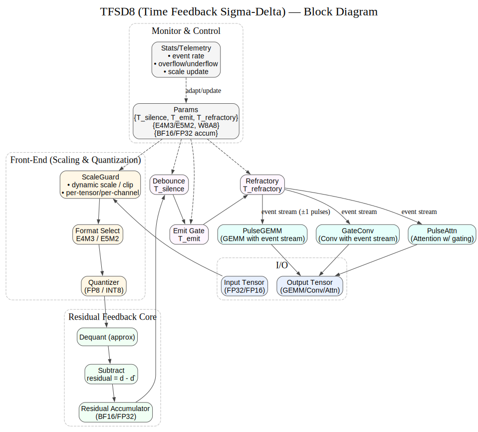

# TFSD8-Neuron-Quant (v0.1.5)

**Disclaimer** : 본 문서는 한국어(KO) 버전이 원본이며, 번역 과정에서 발생할 수 있는 문제나 모호한 부분은 한국어 버전을 참조하시기 바랍니다.


---


[KO](README.md) | [EN](README_en.md) | [ZH](README_zh.md)

---

**TFSD8**는 *변화(차분)*·*이벤트* 중심의 저전력 양자화/부호화 스킴입니다.  
`2^E` 스케일(쉬프트) + FP8 가수 조합으로 **곱셈 없이(shift만)** 넓은 동적 범위를 다룹니다.

---

### 코드네임 변경 알림

본 알고리즘은 기존 UE8M0 명칭에서
새로운 코드네임 **TFSD8** / **TFSD4(UE4T)**  / **TFSD16** , ***(Time Feedback Sigma-Delta Quantization)***  으로 변경되었습니다.

### 서문

> 본 프로젝트에서 사용되는 TFSD8 / TFSD16 코드네임은 단순한 약자가 아닙니다.
과거 아날로그 시대에 연구자들이 개척했던 ΣΔ(Sigma-Delta) 원리와 Residual Feedback 기법은,
데이터를 컴팩트하면서도 정밀하게 표현하는 핵심적 토대였습니다.
> 
>우리는 이러한 <ins>**선구자들의 지혜에 경의를 표하며**</ins>,
여기에 시간(Temporal / Time) 기반 적응 게이팅(Windowing & Refractory Control) 개념을 접목하였습니다.
그 결과, 현대 텐서 연산 환경에 적합한 새로운 양자화 방식이 탄생했습니다.
> 
> 이 철학을 반영하여, 우리는 본 알고리즘을 TFSD8 / TFSD16 (Time Feedback Sigma-Delta Quantization)이라 명명합니다.
이는 과거의 아날로그 ΣΔ 원리 + 현재의 시간 기반 적응 코딩 + 미래의 Tensor 연산 확장성을 담고 있습니다.
> 
> 또한 "T"는 Time / Temporal / Tensor라는 기술적 의미와 더불어,
본 프로젝트의 뿌리인 TrustFarm을 상징하기도 합니다.

--- 



---

## 🧭 Algorithm Details Quick links

TFSD8 Details 

**Docs:** [TFSD8 Details KO](docs/algorithm_full_ko.md) · [TFSD8 Details EN](docs/algorithm_full_en.md) · [TFSD8 Details ZH](docs/algorithm_full_zh.md)


**Diagrams (SVG):**  
- Overview: KO/EN/ZH DOT → `docs/diagrams/ue8m0_overview_auto*.dot`  
- Sync (vertical): KO/EN/ZH DOT → `docs/diagrams/ue8m0_sync_auto_vertical*.dot`  

> Windows 변환: `docs/diagrams/dot2svg.bat` 로 `.dot → .svg`

---

**TFSD4(UE4T)**는 **TFSD8 철학**을 **4비트** 포맷으로 확장한 경량 부호화 방식입니다.  
- 2^E 스케일 (shift) + ΣΔ 이벤트 + 4bit 토큰 맵  
- 작은 변화: ΣΔ ±1, 큰 변화: MAX/MIN, 중간: NORM_ESC+payload  
- 곱셈기 없는 하드웨어 구현 최적화  

- TFSD4 를 활용한 **NeuroMorphic Chip Architecture**
  
👉 [TFSD4(UE4T) v0.3 상세 문서](docs/ue4t_format_v.0.3.md)

---

## 🔥 TFSD4(UE4T): Training 가능한 NeuroSoC의 열쇠

기존 뉴로모픽 칩(SNN 기반)은 **스파이크 여부(0/1)**와 **발화 시점**만으로 정보를 표현하기 때문에,  
정밀한 학습(Training)에는 한계가 있었습니다. ANN은 학습은 가능하지만 전력/자원 소모가 너무 큽니다.

TFSD4(UE4T)는 이 두 가지의 한계를 동시에 극복합니다.

### ✅ 차별화 포인트
- **4bit 토큰으로 스파이크 강도(intensity) 표현**
  - `ΣΔ` → 작은 변화 누적
  - `MAX/MIN` → 큰 변화 이벤트
  - `NORM_ESC + payload(4bit)` → **스파이크 강도 정량화**
  - `SCALE (2^E)` → 동적 범위 확장
- 곱셈기 없이(Shift 기반) FP8 수준의 스케일링 달성

### 🧠 학습(Training) 가능

- 스파이크가 단순한 0/1 이벤트가 아니라 **float-like 값**으로 활용 가능  
- 기존 SNN에선 불가능했던 **Gradient Descent 기반 학습** 가능  
- **대규모 CNN / Transformer 모델까지 학습 확장 가능**

### 📊 비교
| 구분 | 기존 SNN | ANN | **TFSD4(UE4T)** |
|------|----------|-----|----------|
| 표현 | Spike=0/1, Timing | FP32/INT8 등 | **Spike+강도(4bit+Scale)** |
| 학습 | STDP, 국소 규칙 | Gradient Descent | **Gradient Descent 가능** |
| 전력 | 낮음 | 높음 | **낮음 (Shift+Event)** |
| 정밀도 | 낮음 | 높음 | **높음 (강도 표현)** |
| 적용모델 | 단순 패턴 | 대부분 | **복잡한 CNN/Transformer** |

---

> **TFSD4(UE4T)는 “스파이크 강도”를 정량적으로 표현하는 최초의 4bit 이벤트 포맷**입니다.  
> 이를 통해 기존 뉴로모픽이 불가능했던 **학습 가능한 NeuroSoC**를 실현합니다.

---

## ✨ What’s TFSD8?
- **Differential**: 입력 `x`에서 기준 `b`(EMA) 제거 → `d = x - b`  
- **Event-based**: 작은 변화는 ΣΔ ±1 pulse, 큰 변화는 **MAX/MIN** 이벤트  
- **Shift-only scale**: TFSD8의 `E`는 2의 거듭제곱 스케일 → 하드웨어곱셈연산 불필요  
- **FP8 mantissa**: 정밀도 담당(E4M3/E5M2)

---

## ⚙️ Tunable parameters (recommended ranges)
| Name | Meaning | Typical |
|---|---|---|
| `beta` | EMA 계수 | 0.01 ~ 0.2 |
| `lambda0` | 작은 변화 임계 | 센서 민감도에 맞춤 |
| `lambda_hi` | 큰 변화 임계 | 잡음대비 5~20× |
| `T_silence` | ΣΔ 발화 최소 지속 | 5~50 ms |
| `T_emit` | ΣΔ 최소 간격 | 1~10 ms |
| `T_refractory` | MAX/MIN 불응기 | 10~100 ms |
| `T_scale_dwell` | 스케일 체류 | 50~500 ms |
| `near_upper/lower` | FP8 경계 근접 판단 | 상위/하위 10% 등 |

> 장치가 조용하면 `T_silence↑`, 동적 범위가 넓으면 `E5M2`, 미세 감도가 필요하면 `E4M3` 권장.

---

## 🔁 Encoder–Decoder Sync
- 동일한 **EMA(b)·E 갱신**을 공유 → 토큰 유실에도 천천히 동기화 회복
- 예외 상황(토큰 드롭) 복구 팁: q가 경계에 몰리면 **SCALE 추정**(휴리스틱) 적용

---

## 🛠️ Build diagrams
```powershell
# Install graphviz first (dot in PATH)
# Convert single file
docs\diagrams\dot2svg.bat docs\diagrams\ue8m0_overview_auto_en.dot

# Convert recursively
docs\diagrams\dot2svg.bat docs\diagrams
