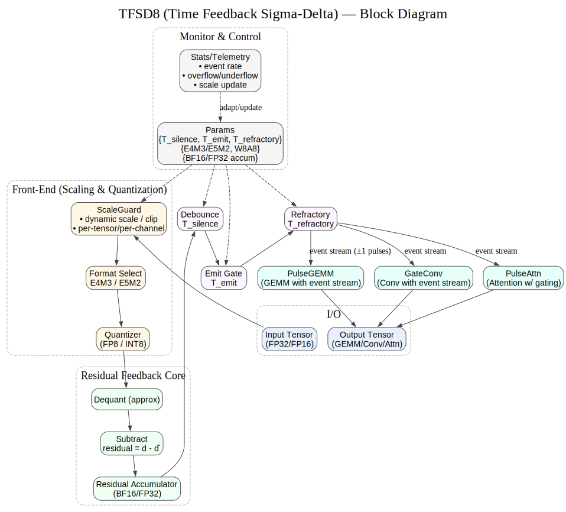

**Disclaimer**: The Korean (KO) version of this document is the original reference. In case of any translation issues or ambiguities, please refer to the Korean version.

---


# TFSD8-Neuron-Quant (v0.1.5)

[KO](README.md) | [EN](README_en.md) | [ZH](README_zh.md)

**TFSD8** is a low-power quantization/encoding scheme focused on *differentials* and *events*.  
By combining a `2^E` shift-only scale with FP8 mantissa, it covers a wide dynamic range **without multipliers** (only shifts).

---

### Codename Update Notice

The algorithm formerly known as UE8M0
is now renamed to **TFSD8** / **TFSD4(UE4T)**  / **TFSD16** , ***(Time Feedback Sigma-Delta Quantization)***.

### Preface

> The codenames TFSD8 / TFSD16 are not mere abbreviations.
In the analog era, pioneering researchers introduced the principles of ΣΔ (Sigma-Delta) modulation and Residual Feedback,
providing a foundation for compact yet accurate data representation.
> 
> We <ins>**honor these early contributions**</ins> by integrating a modern concept:
time-based adaptive gating (Windowing & Refractory Control).
This fusion has led to a new quantization method tailored for contemporary tensor computation environments.
> 
> Reflecting this philosophy, we have named our algorithm TFSD8 / TFSD16 (Time Feedback Sigma-Delta Quantization).
It embodies the wisdom of analog ΣΔ, the adaptivity of temporal coding today, and the extensibility for future tensor operations.
> 
> Furthermore, the letter "T" signifies not only Time / Temporal / Tensor,
but also represents the heritage of TrustFarm, the foundation of this project.

---



---

## 🧭 Algorithm Details Quick links

TFSD8 Details 

**Docs:** [TFSD8 Details KO](docs/algorithm_full_ko.md) · [TFSD8 Details EN](docs/algorithm_full_en.md) · [TFSD8 Details ZH](docs/algorithm_full_zh.md)


**Diagrams (SVG):**  
- Overview: `docs/diagrams/ue8m0_overview_auto_en.dot`  
- Sync (vertical): `docs/diagrams/ue8m0_sync_auto_vertical_en.dot`  

> Windows conversion: use `docs/diagrams/dot2svg.bat` to convert `.dot → .svg`

---

**UE4T** is a lightweight encoding scheme that extends the **TFSD8 philosophy** into a **4-bit format**.  
- 2^E scaling (shift) + ΣΔ events + 4-bit token map  
- Small changes: ΣΔ ±1, Large changes: MAX/MIN, Medium: NORM_ESC+payload  
- Hardware-optimized with no multipliers required  

👉 [UE4T v0.3 Full Documentation](docs/ue4t_format_v.0.3_en.md)

---

## 🔥 UE4T: The Key to Training-Capable NeuroSoCs

Conventional neuromorphic chips (SNN-based) only encode **spike events (0/1)** and **timing**,  
which makes precise training (learning) very limited.  
ANNs can train but consume too much power/resources.

UE4T overcomes both limitations at once.

### ✅ Differentiation
- **4-bit tokens to encode spike intensity**
  - `ΣΔ` → accumulate small differences  
  - `MAX/MIN` → large event  
  - `NORM_ESC + payload(4bit)` → **quantized spike intensity**  
  - `SCALE (2^E)` → expand dynamic range  
- Achieves FP8-like scaling **without multipliers** (shift-only)

### 🧠 Training Capable
- Spikes are no longer just 0/1 events but **float-like values**  
- Enables **Gradient Descent training** that SNNs couldn’t support  
- Extensible to **large-scale CNN / Transformer models**

### 📊 Comparison
| Category | Conventional SNN | ANN | **UE4T** |
|----------|------------------|-----|----------|
| Representation | Spike=0/1, Timing | FP32/INT8 | **Spike+Intensity (4bit+Scale)** |
| Training | STDP, local rules | Gradient Descent | **Gradient Descent possible** |
| Power | Low | High | **Low (Shift+Event)** |
| Precision | Low | High | **High (Intensity expression)** |
| Applicable models | Simple patterns | Most | **Complex CNN/Transformers** |

---

> **UE4T is the first 4-bit event format that quantifies spike intensity.**  
> This enables the world’s first **training-capable NeuroSoC** beyond inference-only neuromorphic chips.

---

## ✨ What’s UE8M0?
- **Differential**: remove baseline `b` (EMA) from input `x` → `d = x - b`  
- **Event-based**: small changes → ΣΔ ±1 pulse, large changes → **MAX/MIN** events  
- **Shift-only scale**: `E` represents power-of-two scaling → no hardware multipliers needed  
- **FP8 mantissa**: provides precision (E4M3/E5M2)

---

## ⚙️ Tunable parameters (recommended ranges)
| Name | Meaning | Typical |
|---|---|---|
| `beta` | EMA coefficient | 0.01 ~ 0.2 |
| `lambda0` | small change threshold | sensor-dependent |
| `lambda_hi` | large change threshold | 5–20× noise level |
| `T_silence` | ΣΔ silence duration | 5–50 ms |
| `T_emit` | ΣΔ minimum interval | 1–10 ms |
| `T_refractory` | MAX/MIN refractory | 10–100 ms |
| `T_scale_dwell` | scale dwell time | 50–500 ms |
| `near_upper/lower` | FP8 boundary proximity | top/bottom 10% |

> If input is quiet → increase `T_silence`.  
> If wide dynamic range → use E5M2.  
> If fine sensitivity → use E4M3.

---

## 🔁 Encoder–Decoder Sync
- Encoder & decoder share **EMA(b) and E updates** → sync recovers gradually even with token loss.  
- Recovery tip: if q clusters near FP8 boundary → apply heuristic **SCALE inference**.

---

## 🛠️ Build diagrams
```powershell
# Install graphviz (dot in PATH)
# Convert single file
docs\diagrams\dot2svg.bat docs\diagrams\ue8m0_overview_auto_en.dot

# Convert recursively
docs\diagrams\dot2svg.bat docs\diagrams
