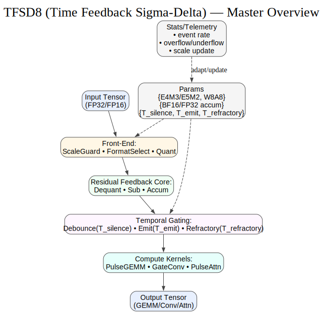
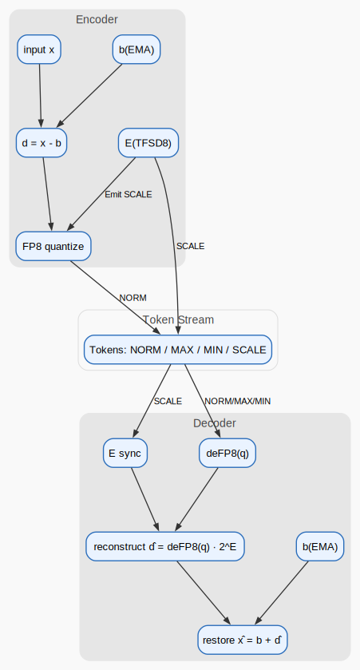

# TFSD8‑Neuron‑Quant Algorithm (v0.1.5)

---
**Disclaimer**: The Korean (KO) version of this document is the original reference. In case of any translation issues or ambiguities, please refer to the Korean version.

---


[KO](algorithm_full_ko.md) | [EN](algorithm_full_en.md) | [ZH](algorithm_full_zh.md)


This document combines **intuitive exposition (examples/flow)** and **technical grounding (math/considerations)** for both general readers and engineers.

---

## 1) Introduction: Why differences & events
Humans respond more to **relative change (difference)** and **events (extrema/saturation)** than absolute levels.
- **Fine touch**: gently rubbing a surface reveals tiny ridges as changes.
- **A fly landing**: a tiny contact is perceived strongly due to sudden onset.

TFSD8‑Neuron‑Quant maps this principle into digital logic for **low‑power, event‑based encoding**.

---
## 2) Terms & Tokens (first)
- **b**: baseline tracked by EMA;  
- **d = x − b**: difference;  
- **E**: TFSD8 scale exponent (2^E);  
- **r**: ΣΔ accumulator (residual / micro‑changes).

**Tokens**
- **NORM(q)**: normal quantized value (FP8 q)  
- **MAX / MIN**: large positive/negative event  
- **SCALE(±1)**: scale step for E  
- **SILENT**: no emission

---
## 3) Key ideas
### 3.1 UINT8 vs FP8 vs TFSD8
- **UINT8**: 0–255; fixed range
- **FP8**: two formats commonly used  
  - **E4M3** higher precision, narrower range  
  - **E5M2** wider range, lower precision
- **TFSD8 (2^E)**: scaling by powers of two → **shift‑based, multiplier‑free**. FP8’s mantissa handles precision; UE8M0 handles dynamic range.

### 3.2 Error‑feedback
After quantization, accumulate `residual = d − d̂` into r to avoid long‑term bias. This acts like **dithering / ΣΔ error feedback**, emitting ±1 pulses over time.

### 3.3 Time parameters
- **T_silence**: debounce; only sustained micro‑changes emit pulses  
- **T_emit**: minimum pulse interval; rate limiting → power saving  
- **T_refractory**: cooldown after MAX/MIN; prevents event storms  
- **T_scale_dwell**: minimum dwell for scale changes; avoids E thrashing

### 3.4 Why EMA for b
EMA is a **low‑pass**; b tracks slow trend, leaving d to capture fast changes.

---
## 4) Encoder (readable pseudocode)
```pseudo
state:
  b, E, r
  t_last_emit, t_last_scale, t_event_quiet, t_silence

for each sample x at time now with step Δt:
  d = x - b

  if now < t_event_quiet:
    b = (1 - beta)*b + beta*x
    continue

  if |d| < lambda0 * 2^E:
    r += d * Δt
    t_silence += Δt
    if t_silence ≥ T_silence and (now - t_last_emit) ≥ T_emit and |r| ≥ 0.5 * 2^E:
       emit NORM(sign(r))
       r -= sign(r) * 2^E
       t_last_emit = now
       t_silence = 0
    b = (1 - beta)*b + beta*x
    continue

  if |d| > lambda_hi * 2^E:
    emit (MAX if d>0 else MIN)
    t_event_quiet = now + T_refractory
    b = (1 - beta)*b + beta*x
    continue

  u = d / 2^E
  q = FP8_quant(u)             # E4M3 or E5M2
  emit NORM(q)

  d_hat = deFP8(q) * 2^E
  r += (d - d_hat)

  if (near_upper(q) or near_lower(q)) and (now - t_last_scale) ≥ T_scale_dwell:
     E += +1 or -1
     emit SCALE(±1)
     t_last_scale = now

  b = (1 - beta)*b + beta*x
  t_silence = 0
```
> Example near rules: `near_upper(q) ⇔ q ≥ 0.9·FP8_MAX`, `near_lower(q) ⇔ q ≤ 0.9·FP8_MIN`

---
## 5) Decoder overview
Share the same E updates via `SCALE(±1)`, reconstruct `NORM(q)` as `deFP8(q) * 2^E`, treat MAX/MIN as threshold events, and update b with the **same EMA** rule for state synchrony.

---
## 6) Implementation tips
- Shift/compare RTL (multiplier‑free) saves power/area  
- Parameter guides:  
  - sensitive sensors → E4M3, small lambda0, short T_silence  
  - wide range → E5M2, large lambda_hi, long T_refractory  
- Use cases: event cameras/tactile, IoT, embedded audio/vibration

---

## 7) Diagrams


- Overview/Temporal/Error Feedback/Scale Flow
  
    

- Encoder / Decoder Token/Sync Stream
  
  


## 8) Encoder–Decoder Example
- [Encoder/Decoder Example](encdec_example_en.md)
