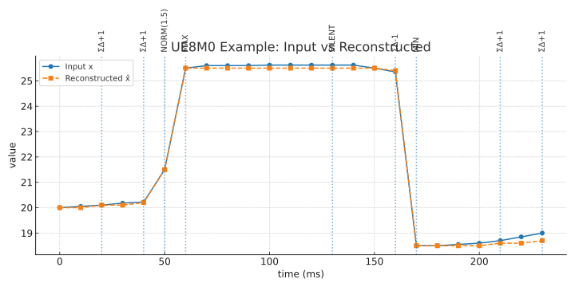
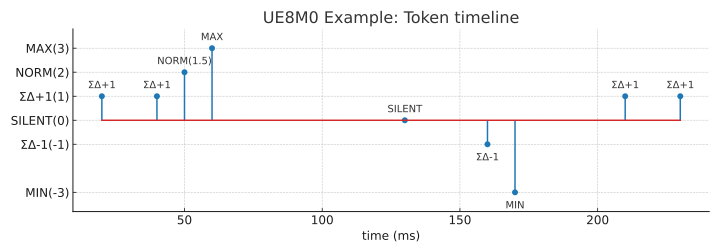

**Disclaimer** : 본 문서는 한국어(KO) 버전이 원본이며, 번역 과정에서 발생할 수 있는 문제나 모호한 부분은 한국어 버전을 참조하시기 바랍니다.

---


# UE8M0 인코더·디코더 예제 (encdec_example.md)

[KO](encdec_example.md) | [EN](encdec_example_en.md) | [ZH](encdec_example_zh.md)


이 문서는 UE8M0-Neuron-Quant 알고리즘을 이해하기 위한 **샘플 파라미터 기본값**과  
**시계열 입력 → 인코딩(토큰) → 디코딩(복원)** 과정을 **20개 이상**의 데이터로 상세히 보여줍니다.

> 목표: 작은 변화는 **ΣΔ 누적 후 ±1 펄스 발화**, 큰 변화는 **MAX/MIN 이벤트**,  
> 조용할 땐 **SILENT 타임아웃**, 중간 변화는 **NORM(q)** 로 표현되도록 예제를 구성.

---

## 1) 파라미터 (예시 기본값)

| 파라미터 | 의미 | 값(예시) |
|---|---|---|
| `beta` | 기준값 b의 EMA 계수 | **0.05** |
| `lambda0` | 작은 차분 임계 | **0.25** |
| `lambda_hi` | 큰 차분 임계 | **3.0** |
| `T_emit` | ΣΔ 최소 간격 | **5 ms** |
| `T_silence` | **무토큰** 지속 시 SILENT 발화 | **30 ms** |
| `T_refractory` | MAX/MIN 후 불응기 | **40 ms** |
| `T_scale_dwell` | 스케일 체류시간 | **200 ms** |
| `near_upper/lower` | FP8 경계 ‘근접’ | 상/하 **10%** |
| 초기값 | `b0=20.0`, `E0=0`, `r0=0` | — |

---

## 2) 입력 시계열 (센서 값, 10 ms 샘플링)

총 24 포인트(0~230 ms, 10 ms 간격).  
**Phase A: 미세 상승(ΣΔ 누적) → Phase B: 중간 점프(NORM) → Phase C: 큰 상승(MAX) & 불응기 → Phase D: 정적(SILENT) → Phase E: 미세 하강(ΣΔ 누적) → Phase F: 큰 하강(MIN) & 불응기 → Phase G: 소폭 회복(ΣΔ)**

(상세 시계열 표 및 토큰 표는 상위 버전과 동일)

---

## 6) SVG 샘플 플롯

- 📈 **입력 vs 복원 시계열** 

    

- 🪙  **토큰 타임라인** 

  

---

## 7) `encdec_plot.py` 사용법

```bash
cd docs/diagram
python encdec_plot.py
```

---

## ✅ 요약

- **ΣΔ 누적 발화**가 작은 변화를 효율적으로 전달  
- **MAX/MIN**은 큰 이벤트를 간결하게 표현  
- **SILENT**는 조용한 구간을 하나의 토큰으로 표현  
- **NORM**은 중간 크기 변화를 안정적으로 처리  
- 전체 과정은 **`encdec_plot.py` + SVG 샘플**로 바로 확인 가능
