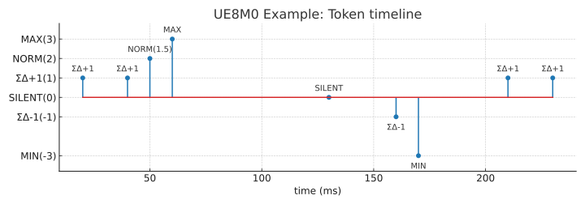

**免责声明**：本文件的韩文 (KO) 版本为原始版本。  
如在翻译中出现问题或歧义，请参考韩文版本。

---

# UE8M0 编码器–解码器示例 (encdec_example_zh.md)


[KO](encdec_example.md) | [EN](encdec_example_en.md) | [ZH](encdec_example_zh.md)


本文档提供了 **示例参数默认值**，并通过 20+ 数据点展示  
**输入时序 → 编码(令牌) → 解码(重建)** 的全过程。

> 目标: 小变化 → **ΣΔ 累积脉冲**，大变化 → **MAX/MIN 事件**，  
> 静默时段 → **SILENT 超时**，中等变化 → **NORM(q)**。

---

## 1) 参数 (示例默认值)

| 参数 | 含义 | 示例值 |
|---|---|---|
| `beta` | EMA 系数 (基线 b) | **0.05** |
| `lambda0` | 小变化阈值 | **0.25** |
| `lambda_hi` | 大变化阈值 | **3.0** |
| `T_emit` | ΣΔ 最小间隔 | **5 ms** |
| `T_silence` | SILENT 事件阈值 | **30 ms** |
| `T_refractory` | MAX/MIN 不应期 | **40 ms** |
| `T_scale_dwell` | 缩放停留时间 | **200 ms** |
| `near_upper/lower` | FP8 边界接近 | 上/下 **10%** |
| 初始值 | `b0=20.0`, `E0=0`, `r0=0` | — |

---

## 2) 输入时序 (传感器数据, 10 ms 采样)

共 24 点 (0–230 ms, 每 10 ms 采样)。  
**Phase A: 小幅上升 (ΣΔ) → Phase B: 中等跳变 (NORM) → Phase C: 大幅上升 (MAX + 不应期) → Phase D: 静默 (SILENT) → Phase E: 小幅下降 (ΣΔ) → Phase F: 大幅下降 (MIN + 不应期) → Phase G: 小幅恢复 (ΣΔ)**

(详细序列表省略，与韩文版相同)

---

## 6) SVG 示例图

- 📈 **输入 vs 重建时序**  
  
    

- 🪙  **令牌时间线**
  
  


---

## 7) `encdec_plot.py` 用法

```bash
cd docs/diagram
python encdec_plot.py
```

---

## ✅ 总结

- **ΣΔ 累积脉冲** 高效传递小变化  
- **MAX/MIN** 简洁表示大事件  
- **SILENT** 用单个令牌表示长时间静默  
- **NORM** 稳健处理中等变化  
- 整个过程可通过 **`encdec_plot.py` + SVG 示例** 直接验证
