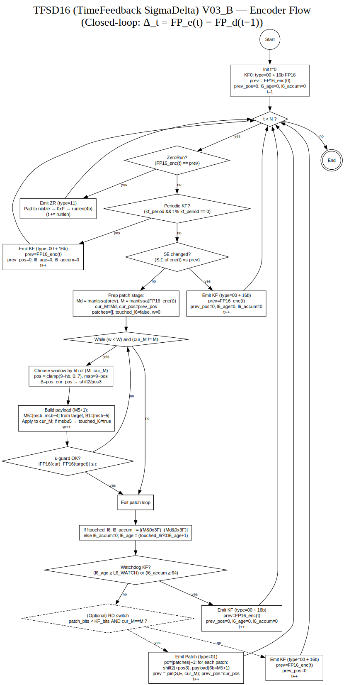

# TFSD16_V0_3b — Integer-Based Packing Encoder (FP16 sign/exp fixed, M5+1 mantissa)

**핵심 아이디어**  
- **Delta_t = FP_e(t) − FP_d(t−1)** (닫힌 루프). 인코더는 디코더가 직전에 복원한 상태를 정확히 알고 그 기준으로 전송합니다.
- **Sign(1)/Exponent(5)**: 그대로 사용(6b 고정). SE 변화 시에는 **KF(16b)**로 단순/안정화.
- **Mantissa(10b)**: 샘플당 최대 W개의 **M5+1** 패치로 복구. 각 패치는 선택된 창의 상위 5비트와 경계 1비트를 **절대치환**.
- **ZeroRun**: type=11, nibble 정렬(`0xF` 마커 + 4비트 길이).  
- **t=0**은 **항상 KF**.

**왜 M5+1?**  
기존 3비트 창에서 MSB 1비트만 갱신하면 수렴이 느립니다. 한 패치로 **5~6비트를 바로 맞추면** 수렴이 빠르고, 필요한 패치 수가 줄어 **BPS/SNR 모두 유리**합니다.

---

## 비트스트림 규격

### 프레임 타입
- `00` : **KF** — 16비트 FP16 필드(Sign/Exp/Mantissa) 그대로 전송  
- `01` : **Patch** — `pc(2b)=count−1` 후, 패치 `pc`개 기록  
- `10` : (예약/향후 SE6) — 본 버전에서는 사용하지 않음 (SE변화는 KF로 처리)  
- `11` : **ZeroRun** — nibble 정렬 → `0xF`(4b) → `runlen`(4b, 1..15)

### Patch 페이로드 (M5+1)
패치마다:
- 위치: `shift2(2b)`; 필요시 `pos3(3b)` (직전 창 대비 -1/0/+1 또는 절대 위치)  
- 페이로드: `M5(5b) + B1(1b)`  
  - `M5`: 선택 창의 `[msb..msb-4]`를 목표 비트로 절대치환  
  - `B1`: 경계 비트 `[msb-5]`를 목표로 치환할지(1) 유지할지(0)

창 선택: `hb = bit_length(M ⊕ Md) − 1`, `pos = clamp(9 − hb, 0..7)`, `msb = 9 − pos`

---

## 인코더 요약 (품질 우선 프로파일)
1. **KF0**(t=0) 전송.  
2. 각 t에서:
   - **ZeroRun**: 직전 복원 FP16과 동일 샘플이 최대 15개면 ZR (nibble 정렬).  
   - **SE 변화**: KF(16b).  
   - **Mantissa 패치**: 최대 **W**개 `M5+1` 패치로 `Md→M` 수렴.  
   - **ε-가드**: FP16 복원값과 목표 FP16 차이가 ε 이하이면 패치 종료.  
   - **하위6 워치독**: 하위6을 오래 못 건드리면(기본 2,205) KF.  
   - **하위6 누적오차**: Σ| (M&0x3F)−(Md&0x3F) | ≥ 64 이면 KF.

> **RD-switch 모드**도 제공: 샘플별 `min(bits(KF), bits(patch))` 선택.

---

## 디코더 요약
- KF: 16비트 수신 → 상태 갱신.  
- Patch: `pc`개 패치 반복. 각 패치에서 창 계산, `[msb..msb-4]`에 `M5` 적용, `[msb-5]`는 `B1`에 따라 치환.  
- ZR: nibble 정렬 후 `0xF` 마커, 길이만큼 직전 값 반복.  
- 스트림 끝에서 **잔여 비트/패딩**은 무시하고 나머지는 직전 값으로 채움.

---
## 파라미터 권장값
- **W**: 2 (저비트 모드: 1)  
- **ε-guard**: 1e−3  
- **KF 주기**: 22,050 (t=0은 항상 KF)  
- **하위6 워치독**: 2,205  
- **하위6 누적 임계**: 64

---

## FlowChart - for Engineering View



 - 자세한 Protocol 에 대한 명세는 [Protocol.md](PROTOCOL.md) 를 참조하세요.

---

## Δ정의와 향후 계획(V0_4)
- 본 버전의 모든 비교/패치는 **`Delta_t = FP_e(t) − FP_d(t−1)`**(FP16 필드 기준)입니다.
- **V0_4 (TFSD16_V0_4)**:  
  - **Emit/Kappa** 알고리즘 재정의도 동일한 Δ로 명시.  
  - **Exp/Mantissa FP6/FP8 델타** 전송(가변길이 부호 포함)으로 **R-D 최적화**.  
  - 프레임 헤더/타입은 유지하되, 맨티사 델타부의 부호화만 교체 가능하게 설계.

---


## 사용법
```bash
cd src
# 기본 (M5+1, 품질 우선)
python run_tfsd16_v0_3b.py LJ001-12concat.wav LJ002-003mix.wav --mode m5p1 --W 2

# 저비트
python run_tfsd16_v0_3b.py LJ001-12concat.wav --mode m5p1 --W 1

# R-D 스위치 (샘플별 KF vs M5+1 최소비트 선택)
python run_tfsd16_v0_3b.py LJ001-12concat.wav --mode rd --W 2
```
출력: `out_<timestamp>/metrics.csv`, 각 비트스트림(`.bin`), 복원 wav(`_dec_*.wav`)


## License
Apache License 2.0 © 2025 TrustFarm  
SPDX-License-Identifier: Apache-2.0