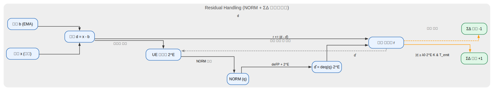
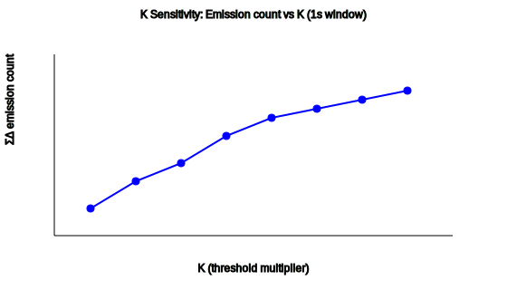
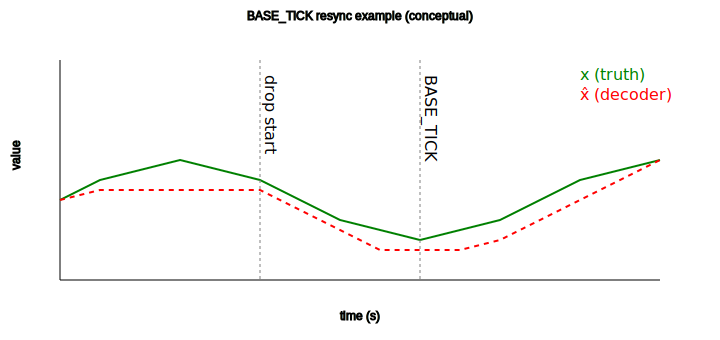

# UE4T: 4-bit Event/Differential Quantization — v0.2

본 문서는 v0.1에서 다음 **핵심 개선**을 반영했습니다.

- **하이브리드 경로**: NORM 후에도 잔차 오차를 ΣΔ 누산기로 전달 → `r ← r + (d - d̂)`
- **K 파라미터 설명 강화**: 발화 민감도/보수성 제어용 스케일러
- **BASE_TICK 구체화**: 재동기화(resync) 시나리오와 구현 팁

---
  -- 1st v0.1 detailed description from [guderi_and_Q&A](guderi-q_and_a-suggest.md) **Purpose of Development of This Researchs** 
  -- get [feedback](4bits_quant/guderi_ue4t_feedback_1.md) and upgrade algorithm for more suitable to NeuroMorphic SoC , Neuron FrontEnd.
   
## 1) 개요 (요약)
UE4T는 **2^E 스케일**(쉬프트) + **저비트 토큰(4bit)** + **ΣΔ 이벤트**를 결합한 경량 부호화입니다.  
- **Differential**: 입력에서 EMA 기반 기준 `b`를 제거 → `d = x - b`  
- **Event-based**: 작은 변화는 **ΣΔ 펄스(±1)**, 큰 변화는 **MAX/MIN**, 중간은 **NORM**  
- **Shift-only**:乘法 없이 `2^E`로 스케일 → 하드웨어 효율 ↑

---

### 1-1) 기본 알고리즘은 [ue4t_format_v.0.1.md](ue4t_format_v.0.1.md) 를 참고하세요.
### 1-2) 알고리즘의 지향점과 차별화된 점은 [ue4t_v0.2 일반인이 이해하기 쉬운 설명](ue4t_v0.2_description.md) 를 참고하세요.

## 2) 토큰 맵(요약)
- `SILENT(0x0)`, `SD±(0x1/0x2)`, `SCALE±(0x3/0x4)`, `MAX/MIN(0x5/0x6)`,  
  `BASE_TICK(0x7)`, `NORM_ESC(0x8)+payload(1 nibble)`, `RLE_ESC(0x9)+len`, `RESET(0xA)` …

`NORM` 페이로드: `Δ ≈ sign * (1 + m/8) * 2^E`, `m∈[0..7]`

---

## 3) 인코더 (핵심 변경 반영)
의사코드 요점만 발췌합니다.

```
for each (x, now):
d = x - b
if now < t_refrac_end: goto update # 불응기

if |d| < λ0·2^E: # 작은 변화 → ΣΔ 누산
r += d
if (now - t_last_emit ≥ T_emit) and (|r| ≥ λ0·2^E·K):
emit(SD±); r -= sign(r)·(λ0·2^E·K); t_last_emit = now
goto update

if |d| > λhi·2^E: # 큰 변화 → MAX/MIN
emit(MAX or MIN); t_refrac_end = now + T_refrac; r = 0
goto update
```
중간 변화 → NORM

q = quantize_NORM(d / 2^E) # sign + m/8
emit(NORM_ESC); emit(q.payload)
d̂ = dequant(q) * 2^E

update:

중요: NORM 후에도 r에 잔차 반영

r += (d - d̂) # 하이브리드 경로(바이어스 저감)

선택적 스케일 적응

maybe_emit(SCALE±) if dwell & near

기준 갱신

b = (1-β)·b + β·x

무토큰 구간 알림

if now - t_last_token ≥ T_silence: emit(SILENT) or RLE_ESC
**K 파라미터**: `|r| ≥ λ0·2^E·K`  
- `K=1`(기본) / `K>1` → 발화 둔감(보수적) / `K<1` → 민감(공격적)

---

## 4) 디코더 (요약)
- 인코더와 동일한 `b`·`E` 갱신 룰 공유
- 토큰 처리: `SD±`, `NORM_ESC+payload`, `MAX/MIN`, `SCALE±`, `SILENT/RLE`, `BASE_TICK`
- 통신/전송 이슈 대비: 주기적 `BASE_TICK`(b 힌트) 또는 `CRC4` 권장

---

## 5) 구현 팁
- ΣΔ 누산기 `r`는 고정소수점 **12~16bit** 추천(데이터/환경에 따라 상향)  
- `λhi/λ0`는 **5~20×** 범위에서 센서 SNR/다이내믹레인지에 맞게 결정  
- E 포맷: 미세 정밀 → `E4M3` / 넓은 범위 → `E5M2` (UE8M0 연계 시)

---

## Appendix A. Residual Handling Flow
NORM 후에도 잔차를 누산기로 돌려보내는 경로 도식입니다.



---

## Appendix B. K Sensitivity Plot
K 값을 변화시키며 1초 윈도우에서 ΣΔ 발화량을 측정한 예시입니다.



- `K`가 커질수록 임계가 커져 **발화 횟수 감소**  
- `K`가 작을수록 민감해져 **발화 횟수 증가** (전송량↑, 미세감지↑)

---

## Appendix C. BASE_TICK Resync Timeline
토큰 드롭 후 `BASE_TICK`으로 b가 재동기화되는 개념 예시입니다.



- `drop start` 이후 디코더 출력 x̂가 오프셋 드리프트  
- `BASE_TICK` 시점에 기준이 회복되어 x에 재정렬

---

## Appendix D. 구현 상세 (빠른 합의용)

**1) LUT/연산**
- NORM 가수 LUT: `1.000 ~ 1.875` (1/8 step)
- UE 스케일: **shift-only** (`2^E`) — multiplier 미사용

**2) 고정소수점 제안**
- `r`: 12~16bit 정밀(환경 따라 20bit까지 고려)
- `b`: EMA 필터 계수 `β=0.02~0.1` 권장

**3) 튜닝 가이드(요약)**
- 정적/저잡음: `K↓, β↓`로 민감도 확보
- 동적/고잡음: `K↑, λhi↑, T_emit↑`로 발화 억제
- 드롭/패킷손실: `BASE_TICK` 주기적 송신(수초 간격) + `RLE`/`SILENT` 활용

---

**Changelog v0.2**  
- NORM 후 잔차 반영(`r += (d - d̂)`) 명시
- K 파라미터 설명/시뮬레이션 플롯 추가
- BASE_TICK 재동기화 도식 추가
