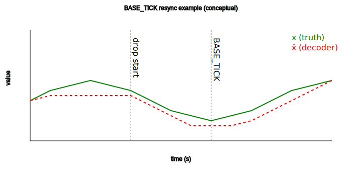

**Disclaimer** : 본 문서는 한국어(KO) 버전이 원본이며, 번역 과정에서 발생할 수 있는 문제나 모호한 부분은 한국어 버전을 참조하시기 바랍니다.

---


# UE4T: 4-bit Event/Differential Quantization — v0.3

UE4T는 UE8M0의 철학(**차분·이벤트·2^E 스케일·EMA(b)**)을 유지하면서, **토큰을 4비트(니블)**로 표현하는 포맷입니다.  
목표는 **곱셈 없이(shift)**, **작은 LUT**와 **ΣΔ 누산**으로 미세 변화를 효율적으로 전달하는 것입니다.

---

## 1) 주요 개선 사항 (v0.2 → v0.3)

- **하이브리드 경로**: NORM 후에도 잔차 오차를 ΣΔ 누산기로 전달 → `r ← r + (d - d̂)`
- **K 파라미터 설명 보강**: 민감도/보수성 제어용 스케일러
- **BASE_TICK**: 재동기화(resync) 시나리오 구체화
- **문서 정리**: 오타/정렬/목차 개선

---

## 2) 토큰 맵 (4-bit 코드 공간)

| Code | Token      | 설명 |
|:---:|:-----------|:-----|
| 0x0 | SILENT     | 무토큰 구간 알림(타임아웃), RLE와 조합 가능 |
| 0x1 | SD+        | ΣΔ +1 펄스(미세 상승) |
| 0x2 | SD-        | ΣΔ -1 펄스(미세 하강) |
| 0x3 | SCALE+     | E ← E+1 (2배 스케일) |
| 0x4 | SCALE-     | E ← E-1 (1/2 스케일) |
| 0x5 | MAX        | 상한 이벤트(포화/상경계) |
| 0x6 | MIN        | 하한 이벤트(포화/하경계) |
| 0x7 | BASE_TICK  | b(EMA) 동기 힌트(옵션) |
| 0x8 | NORM_ESC   | 다음 니블이 NORM 페이로드 |
| 0x9 | RLE_ESC    | 다음 니블이 SILENT run-length |
| 0xA | RESET      | 상태 재동기(옵션) |
| 0xB | KEEPALIVE  | 상태 유지 하트비트(옵션) |
| 0xC~0xF | RSV/CRC | 예약/CRC4 등 |

### NORM 페이로드 (1니블)
- `p[3]` = 부호 (0=+, 1=−)  
- `p[2:0]` = 가수 인덱스 m ∈ {0..7}  
- 값: `Δ ≈ sign * (1 + m/8) * 2^E`  
- LUT: {1.000, 1.125, 1.250, …, 1.875}

---

## 3) 인코더 개요 (의사코드)

```text
for each (x, now):
  d = x - b

  # 불응기
  if now < t_refrac_end: continue

  # 작은 변화: ΣΔ 누산
  if |d| < λ0·2^E:
     r += d * Δt
     if (now - t_last_emit ≥ T_emit) and (|r| ≥ (λ0·2^E)·K):
        emit(SD±)
        r -= sign(r)·(λ0·2^E)·K
        t_last_emit = now
     goto update

  # 큰 변화: MAX/MIN
  if |d| > λhi·2^E:
     emit(MAX or MIN)
     t_refrac_end = now + T_refrac
     r = 0
     goto update

  # 중간 변화: NORM
  (sign, m) = quantize_NORM(d / 2^E)
  emit(NORM_ESC); emit(payload(sign,m))
  d̂ = dequant(q) * 2^E

update:
  # NORM 후에도 잔차 반영
  r += (d - d̂)

  # 선택적 스케일 적응
  maybe_emit(SCALE±)

  # 기준 업데이트
  b = (1-β)·b + β·x

  # 무토큰 구간 알림
  if now - t_last_token ≥ T_silence:
      emit(SILENT) or emit(RLE_ESC,len)
```

---
## 4) 디코더 요약

- 인코더와 동일한 `b`·`E` 갱신 룰 공유

- 토큰 처리: `SD±`, `NORM_ESC+payload`, `MAX/MIN`, `SCALE±`, `SILENT/RLE`, `BASE_TICK`

- 전송 이슈 대비: `BASE_TICK` 주기적 송신, `CRC4` 활용 권장

---
## 5) 파라미터 튜닝 가이드

| 파라미터            | 의미          | 권장 범위        |
| --------------- | ----------- | ------------ |
| β (beta)        | EMA 계수      | 0.01 \~ 0.2  |
| λ0              | 작은 변화 임계    | 센서 민감도 기준    |
| λhi             | 큰 변화 임계     | λ0 대비 5\~20× |
| K               | ΣΔ 발화 민감도   | 0.5 \~ 3     |
| T\_emit         | ΣΔ 최소 간격    | 1\~10 ms     |
| T\_silence      | SILENT 타임아웃 | 5\~50 ms     |
| T\_refrac       | MAX/MIN 불응기 | 10\~100 ms   |
| T\_scale\_dwell | SCALE 체류    | 50\~500 ms   |

---
## 6) Appendix (도식)

- Residual Handling Flow → 

- K Sensitivity Plot → 

- BASE_TICK Resync Timeline → 

---

## 7) 📎 관련 자료 : Trustfarm AI UE4T NeuroMorphic Chip Architecture
- [TFAI NMC Architecture](ue4t_nmc/TFAI_NMC_Architecture.md)

---
## 8) 향후 검증 (TODO)
  1. LLM 적용 (UE8M0/UE4T quantization → perplexity/accuracy vs 효율)
  2. FPGA 기반 simulation (cycle-level 자원/전력)
  3. 학습 지원 아키텍처 (SCALE learnable, pseudo-gradient)
  4. YOLO/Whisper 등 대규모 시계열 데이터 검증 (mAP, WER, throughput)
---

## Changelog v0.3 a1
- Adds TFAI NMC architecture
- v0.2 기반 내용 정리
- 오타/정렬/표식 개선
- K, BASE_TICK 설명 강화
- TODO 리스트 추가