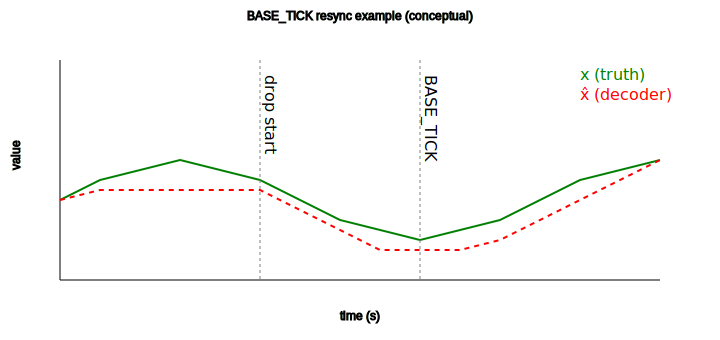

**Disclaimer**: The Korean (KO) version of this document is the original reference. In case of any translation issues or ambiguities, please refer to the Korean version.

---


# UE4T: 4-bit Event/Differential Quantization — v0.3

UE4T keeps the UE8M0 philosophy (**differential, event-driven, 2^E scaling, EMA(b)**) while expressing **tokens in 4 bits (nibble)**.  
The goal is to efficiently convey small changes **without multipliers (shift)**, using a **small LUT** and **ΣΔ accumulation**.

---

## 1) Key improvements (v0.2 → v0.3)

- **Hybrid path**: After NORM, the residual error is still fed to the ΣΔ accumulator → `r ← r + (d - d̂)`
- **K parameter clarified**: Sensitivity/conservativeness scaler with tuning guidance
- **BASE_TICK**: More concrete resynchronization scenarios and tips
- **Document cleanup**: Typos, section order, and formatting improved

---

## 2) Token map (4-bit code space)

| Code | Token      | Description |
|:---:|:-----------|:------------|
| 0x0 | SILENT     | Idle segment notice (timeout); can combine with RLE |
| 0x1 | SD+        | ΣΔ +1 pulse (small upward change) |
| 0x2 | SD-        | ΣΔ −1 pulse (small downward change) |
| 0x3 | SCALE+     | E ← E+1 (×2 scale) |
| 0x4 | SCALE-     | E ← E−1 (×½ scale) |
| 0x5 | MAX        | Upper-bound event (saturation / top boundary) |
| 0x6 | MIN        | Lower-bound event (saturation / bottom boundary) |
| 0x7 | BASE_TICK  | b(EMA) sync hint (optional) |
| 0x8 | NORM_ESC   | Next nibble is a NORM payload |
| 0x9 | RLE_ESC    | Next nibble is SILENT run-length |
| 0xA | RESET      | State resynchronization (optional) |
| 0xB | KEEPALIVE  | Heartbeat to keep state alive (optional) |
| 0xC~0xF | RSV/CRC | Reserved / periodic CRC4, etc.

### NORM payload (1 nibble)
- `p[3]` = sign (0 = +, 1 = −)  
- `p[2:0]` = mantissa index m ∈ {0..7}  
- Value: `Δ ≈ sign * (1 + m/8) * 2^E`  
- LUT: {1.000, 1.125, 1.250, …, 1.875}

---

## 3) Encoder overview (pseudocode)

```text
for each (x, now):
  d = x - b

  # Refractory
  if now < t_refrac_end: continue

  # Small change: ΣΔ accumulation
  if |d| < λ0·2^E:
     r += d * Δt
     if (now - t_last_emit ≥ T_emit) and (|r| ≥ (λ0·2^E)·K):
        emit(SD±)
        r -= sign(r)·(λ0·2^E)·K
        t_last_emit = now
     goto update

  # Large change: MAX/MIN
  if |d| > λhi·2^E:
     emit(MAX or MIN)
     t_refrac_end = now + T_refrac
     r = 0
     goto update

  # Medium change: NORM
  (sign, m) = quantize_NORM(d / 2^E)
  emit(NORM_ESC); emit(payload(sign,m))
  d̂ = dequant(q) * 2^E

update:
  # Important: keep residual feedback even after NORM
  r += (d - d̂)

  # Optional: scale adaptation
  maybe_emit(SCALE±)

  # Update baseline
  b = (1-β)·b + β·x

  # Idle notice
  if now - t_last_token ≥ T_silence:
      emit(SILENT) or emit(RLE_ESC,len)
```

---

## 4) Decoder summary

 - Shares the same `b` and `E` update rules as the encoder

 - Token handling: `SD±`, `NORM_ESC+payload`, `MAX/MIN`, `SCALE±`, `SILENT/RLE`, `BASE_TICK`

 - Robustness: periodically send `BASE_TICK` (b hint) and/or use `CRC4`

---

## 5) Parameter tuning guide

| Parameter       | Meaning                 | Recommended range           |
| --------------- | ----------------------- | --------------------------- |
| β (beta)        | EMA coefficient         | 0.01 \~ 0.2                 |
| λ0              | Small-change threshold  | Based on sensor sensitivity |
| λhi             | Large-change threshold  | 5\~20× of λ0                |
| K               | ΣΔ emission sensitivity | 0.5 \~ 3                    |
| T\_emit         | Minimum ΣΔ interval     | 1\~10 ms                    |
| T\_silence      | SILENT timeout          | 5\~50 ms                    |
| T\_refrac       | Refractory for MAX/MIN  | 10\~100 ms                  |
| T\_scale\_dwell | SCALE dwell time        | 50\~500 ms                  |

---

## 6) Appendix (diagrams)

- Residual Handling Flow → 

- K Sensitivity Plot → 

- BASE_TICK Resync Timeline → 

---
## 7) 📎 Related Works : Trustfarm AI UE4T NeuroMorphic Chip Architecture
- [TFAI NMC Architecture](ue4t_nmc/TFAI_NMC_Architecture.md)

---

## 7) Future validation (TODO)

1. Apply to LLMs (UE8M0/UE4T quantization → perplexity/accuracy vs efficiency)

2. FPGA-based simulation (cycle-level resources/power)

3. Training-capable architecture (learnable SCALE, pseudo-gradient)

4. Validation on large 3D time-series models such as YOLO/Whisper (mAP, WER, throughput)

---

## Changelog v0.3 a1
- Adds TFAI NMC architecture
- Consolidated from v0.2
- Typos/formatting fixed
- K, BASE_TICK descriptions strengthened
- TODO list added
