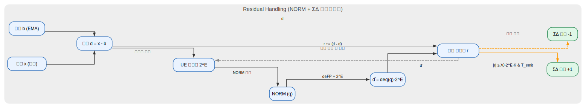

**免责声明**：本文件的韩文 (KO) 版本为原始版本。  
如在翻译中出现问题或歧义，请参考韩文版本。

---


# UE4T：4位 事件/差分 量化 — v0.3

[KO](ue4t_format_v.0.3.md) | [EN](ue4t_format_v.0.3_en.md) | [ZH](ue4t_format_v.0.3_zh.md)


UE4T 保持 UE8M0 的理念（**差分、事件驱动、2^E 缩放、EMA(b)**），并将 **令牌用 4 位（nibble）** 表达。  
目标是通过 **无需乘法器（移位）**、**小型 LUT** 与 **ΣΔ 累加**，高效传递微小变化。

---

## 1) 主要改进（v0.2 → v0.3）

- **混合路径**：NORM 之后仍将残差回馈至 ΣΔ 累加器 → `r ← r + (d - d̂)`
- **K 参数说明**：用于灵敏度/保守性的缩放器，并给出调参建议
- **BASE_TICK**：更具体的重同步场景与实现提示
- **文档整理**：修正错别字、优化章节与格式

---

## 2) 令牌映射（4 位代码空间）

| Code | Token      | 说明 |
|:---:|:-----------|:-----|
| 0x0 | SILENT     | 空闲段提示（超时）；可与 RLE 结合 |
| 0x1 | SD+        | ΣΔ +1 脉冲（微小上升） |
| 0x2 | SD-        | ΣΔ −1 脉冲（微小下降） |
| 0x3 | SCALE+     | E ← E+1（×2 缩放） |
| 0x4 | SCALE-     | E ← E−1（×½ 缩放） |
| 0x5 | MAX        | 上边界事件（饱和/上限） |
| 0x6 | MIN        | 下边界事件（饱和/下限） |
| 0x7 | BASE_TICK  | b(EMA) 同步提示（可选） |
| 0x8 | NORM_ESC   | 下一个 nibble 为 NORM 载荷 |
| 0x9 | RLE_ESC    | 下一个 nibble 为 SILENT 的游程长度 |
| 0xA | RESET      | 状态重同步（可选） |
| 0xB | KEEPALIVE  | 保活心跳（可选） |
| 0xC~0xF | RSV/CRC | 预留/周期性 CRC4 等

### NORM 载荷（1 nibble）
- `p[3]` = 符号（0 = +，1 = −）  
- `p[2:0]` = 尾数索引 m ∈ {0..7}  
- 值：`Δ ≈ sign * (1 + m/8) * 2^E`  
- LUT：{1.000, 1.125, 1.250, …, 1.875}

---

## 3) 编码器概览（伪代码）

```text
for each (x, now):
  d = x - b

  # 不应期
  if now < t_refrac_end: continue

  # 小变化：ΣΔ 累加
  if |d| < λ0·2^E:
     r += d * Δt
     if (now - t_last_emit ≥ T_emit) and (|r| ≥ (λ0·2^E)·K):
        emit(SD±)
        r -= sign(r)·(λ0·2^E)·K
        t_last_emit = now
     goto update

  # 大变化：MAX/MIN
  if |d| > λhi·2^E:
     emit(MAX or MIN)
     t_refrac_end = now + T_refrac
     r = 0
     goto update

  # 中等变化：NORM
  (sign, m) = quantize_NORM(d / 2^E)
  emit(NORM_ESC); emit(payload(sign,m))
  d̂ = dequant(q) * 2^E

update:
  # 重点：NORM 后仍进行残差回馈
  r += (d - d̂)

  # 可选：尺度自适应
  maybe_emit(SCALE±)

  # 基线更新
  b = (1-β)·b + β·x

  # 空闲提示
  if now - t_last_token ≥ T_silence:
      emit(SILENT) or emit(RLE_ESC,len)

```
---

## 4) 解码器摘要

- 与编码器共享相同的 `b`、`E` 更新规则
- 令牌处理：`SD±`、`NORM_ESC+payload`、`MAX/MIN`、`SCALE±`、`SILENT/RLE`、`BASE_TICK`
- 鲁棒性：建议周期性发送 `BASE_TICK`（b 提示）/ 或使用 `CRC4`

---

## 5) 参数调优指南

| 参数              | 含义          | 建议范围        |
| --------------- | ----------- | ----------- |
| β (beta)        | EMA 系数      | 0.01 \~ 0.2 |
| λ0              | 小变化阈值       | 基于传感器灵敏度    |
| λhi             | 大变化阈值       | λ0 的 5\~20× |
| K               | ΣΔ 发火灵敏度    | 0.5 \~ 3    |
| T\_emit         | ΣΔ 最小间隔     | 1\~10 ms    |
| T\_silence      | SILENT 超时时间 | 5\~50 ms    |
| T\_refrac       | MAX/MIN 不应期 | 10\~100 ms  |
| T\_scale\_dwell | SCALE 停留时间  | 50\~500 ms  |

---

## 6) 附录（图示）

- Residual Handling Flow → 
- K Sensitivity Plot → 
- BASE_TICK Resync Timeline → 

---

## 7) 📎 Related Works : Trustfarm AI UE4T NeuroMorphic Chip Architecture
- [TFAI NMC Architecture](ue4t_nmc/TFAI_NMC_Architecture.md)

---

## 7) 后续验证（TODO）

1. 应用于 LLM（UE8M0/UE4T 量化 → 困惑度/准确率 vs 效率）

2. 基于 FPGA 的仿真（周期级资源/功耗）

3. 支持训练的架构（可学习的 SCALE、伪梯度）

4. 在 YOLO/Whisper 等大规模三维时序模型上验证（mAP、WER、吞吐）

---

## Changelog v0.3 a1
- Adds TFAI NMC architecture
- 基于 v0.2 的整合
- 修复错别字与格式
- 加强 K、BASE_TICK 说明
- 新增 TODO 列表
