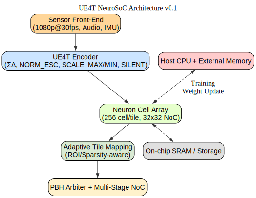
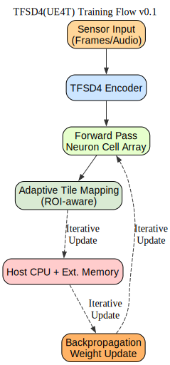
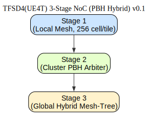
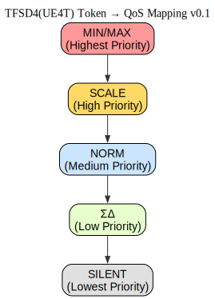
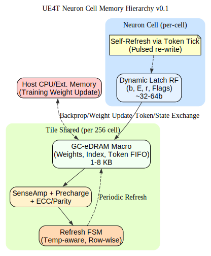

**Disclaimer** : 본 문서는 한국어(KO) 버전이 원본이며, 번역 과정에서 발생할 수 있는 문제나 모호한 부분은 한국어 버전을 참조하시기 바랍니다.

---

# TFAI NeuroMorphic Chip (NMC) Architecture

[KO](TFAI_NMC_Architecture.md) | [EN](TFAI_NMC_Architecture_en.md) | [ZH](TFAI_NMC_Architecture_zh.md)

본 문서는 **UE4T 기반 NeuroMorphic ASIC**의 외부 공개용 아키텍처를 설명합니다.  
UE4T는 **이벤트 기반(event-driven)**과 **스파이크 강도(spike intensity) 표현**을 동시에 지원하는 4bit 포맷으로,  
기존 SNN(Spiking Neural Network)과 ANN(Artificial Neural Network)의 한계를 극복합니다.

---

## 🔑 UE4T 차별화 포인트

1. **Spike Intensity 표현**  
   - 기존 SNN: 발화 여부(0/1)와 타이밍만 표현 → 정밀 수치 정보 부족  
   - UE4T: `NORM_ESC + 4bit payload`를 통해 **강도(magnitude)**를 정량적으로 전달  
   - 결과적으로 Gradient Descent 기반 학습 가능

2. **곱셈기 없는 ALU (Shift-only)**  
   - 모든 스케일링을 `2^E` (bit-shift)로 구현 → 승산기 불필요  
   - 전력 소모 및 실리콘 면적 절감 → 저전력 학습/추론 SoC 구현 가능

3. **시간·이벤트 압축**  
   - 작은 변화: `ΣΔ 누적`  
   - 큰 변화: `MAX/MIN 이벤트`  
   - 조용한 구간: `SILENT 토큰`  
   - 대규모 시계열 입력(영상, 음성, 센서 데이터)을 효율적으로 표현

4. **PBH 기반 NoC**  
   - **Pipelined Binary Heap (PBH) Arbiter**로 토큰 우선순위 라우팅  
   - Token Class → QoS 매핑: `MIN/MAX > SCALE > NORM > ΣΔ > SILENT`  
   - 토큰 클래스 자체가 네트워크 우선순위와 직결 

---

## 🧩 System Architecture

- **Sensor Front-End**: 카메라(1080p@30fps), 오디오, IMU 등 시계열 입력  
- **UE4T Encoder**: 입력 신호를 4bit 토큰 스트림으로 변환  
- **Neuron Cell Array**: 256 cell/tile, 32×32 NoC (8192 tile, 수십만~수백만 cell 확장 가능)  
- **Adaptive Tile Mapping**: ROI·sparsity 기반 tile 크기 동적 조정 → CNN 학습 최적화  
- **PBH Arbiter + Multi-Stage NoC**: Token 우선순위 기반 라우팅  
- **Host CPU & External Memory**: 학습 시 weight 업데이트, 데이터셋 I/O 관리  
- **On-chip SRAM / Storage**: Token buffer, 파라미터 저장

---

## 📚 Training Flow

1. Sensor 입력 → UE4T Encoder → 4bit 토큰  
2. Forward Pass: Token → Neuron Cell Array  
3. Host CPU + External Memory: Backpropagation & Weight Update  

**자원 요구량**  
- CNN은 기본적으로 **고정 커널 + 균일 연산** 구조 → POI (Point Of Interest) 밖에서도 불필요한 연산 발생.  
- 최근 영상 알고리즘(예: Video Codec, Object Detection)은 **adaptive tiling** 기법을 적용,  
  POI 영역은 작은 tile로, 배경은 큰 tile로 처리하여 효율을 극대화.  
- UE4T NMC도 동일 원리 채택: **뉴런셀과 tile 매핑을 유연하게 적용**.  
- 현재 설계 목표: **약 10만 개 뉴런셀 단위에서 adaptive tiling 지원**.  
- 이로써 CNN 학습 시에도 자원 낭비 없이 실시간 학습 최적화 가능.

---

## ⚡ Inference Flow

1. 동일 입력 (1080p@30fps) → UE4T Encoder  
2. Forward-only Token Path → Neuron Cell Array  
3. Host CPU 최소 개입 (Weight 고정, Δb/ΔE 불필요)  
4. Inference는 학습 대비 **약 1/10 수준 자원으로 충분**

---

## 🌐 NoC 구조

- **Stage 1 (Local Mesh)**: Tile 내부 256 cell 간/타일 간 연결  
- **Stage 2 (Cluster Tree)**: Binary Heap 기반 Arbiter (우선순위 적용)  
- **Stage 3 (Global Backbone)**: Hybrid Mesh-Tree (확장성 + 효율)  

장점:  
- Tree 구조 → Latency 최소화  
- PBH Arbiter → Token class별 QoS 보장  
- Hybrid Mesh-Tree → 확장성과 안정적 대역폭 확보

---

## 🎯 Token → QoS Mapping

- MIN/MAX: 최고 우선순위 → 즉시 전달  
- SCALE: 동적 범위 조정 → 높은 우선순위  
- NORM: 일반 신호 → 중간 우선순위  
- ΣΔ: 작은 변화 누적 → 낮은 우선순위  
- SILENT: 유휴 구간 → 가장 낮은 우선순위

---

## 🔑 Additional Improvements Plan

 - 기존 Neuron Cell 블록에서 전력소모가 많은 SRAM 대신 DRAM-like 한 Dynamic Latch 구조적용안.

 - [Detailed Description of **TFAI Neuron Cell Memory Hierarchy (v0.1)**](Neuron_Cell_Memory.md)
 - 

 - More Detailed Study of DRAM-like Memory in SoC is 
 - [UE4T 뉴런 셀 내 DRAM-like 메모리 스터디 (v0.2)](UE4T_Neuron_DRAMlike_Study_v0.2.md)

---

## 📌 Summary

- UE4T 기반 NMC는 **Adaptive Tiling + Spike Intensity 표현**으로 CNN 학습까지 지원  
- 기존 SNN 대비 → 학습 가능성 확보  
- 기존 ANN 대비 → Shift-only ALU로 전력 절감  
- Hybrid NoC + PBH Arbiter → Token QoS 기반 실시간 라우팅  
- CNN/Transformer 학습·추론 모두 지원, 대규모 비디오/오디오 실시간 처리 가능
