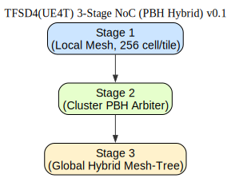

**Disclaimer**: The Korean (KO) version of this document is the original reference. In case of any translation issues or ambiguities, please refer to the Korean version.

---

# TFAI NeuroMorphic Chip (NMC) Architecture

[KO](TFAI_NMC_Architecture.md) | [EN](TFAI_NMC_Architecture_en.md) | [ZH](TFAI_NMC_Architecture_zh.md)

This document describes the external-facing architecture of the UE4T-based NeuroMorphic ASIC. UE4T is a 4-bit format that simultaneously supports **event-driven and spike intensity representation**, overcoming the limitations of conventional Spiking Neural Networks (SNNs) and Artificial Neural Networks (ANNs).

---

## 🔑 UE4T Differentiators
1. **Spike Intensity** Representation
   - Conventional SNN: Represents only firing (0/1) and timing → Lacks precise numerical information.
   - UE4T: Quantitatively conveys magnitude through `NORM_ESC + 4bit payload`.
   - Result: Enables Gradient Descent-based training.

2. **Multiplier-less ALU (Shift-only)**
   - All scaling is implemented with `2^E` (bit-shift) → No need for multipliers.
   - Reduces power consumption and silicon area → Enables low-power training/inference SoC.

3. **Time and Event Compression**
   - Small changes: `ΣΔ accumulation`.
   - Large changes: `MAX/MIN` events.
   - Quiet periods: `SILENT` token.
   - Efficiently represents large-scale time-series inputs (video, audio, sensor data).

4. **PBH-based NoC**
   - Pipelined Binary Heap (PBH) Arbiter for token priority routing.
   - Token Class → QoS Mapping: `MIN/MAX > SCALE > NORM > ΣΔ > SILENT`.
   - The token class itself is directly tied to network priority.

---

## 🧩 System Architecture

 - **Sensor Front-End**: Time-series inputs such as camera (1080p@30fps), audio, and IMU.
 - **UE4T Encoder**: Converts input signals into a 4-bit token stream.
 - **Neuron Cell Array**: 256 cells/tile, 32×32 NoC (8192 tiles, scalable to hundreds of thousands or millions of cells).

 - **Adaptive Tile Mapping**: Dynamically adjusts tile size based on ROI and sparsity → Optimizes CNN training.
 - **PBH Arbiter + Multi-Stage NoC**: Priority-based routing for tokens.
 - **Host CPU & External Memory**: Manages weight updates and dataset I/O during training.
 - **On-chip SRAM / Storage**: Token buffer, parameter storage.

---

## 📚 Training Flow

1. Sensor input → UE4T Encoder → 4-bit token.
2. Forward Pass: Token → Neuron Cell Array.
3. Host CPU + External Memory: Backpropagation & Weight Update.

**Resource Requirements**
- CNNs typically have a fixed kernel + uniform computation structure → Unnecessary computations occur outside the POI (Point Of Interest).
- Recent video algorithms (e.g., Video Codec, Object Detection) apply **adaptive tiling techniques**, processing POI areas with small tiles and background with large tiles to maximize efficiency.
- The UE4T NMC adopts the same principle: **flexible mapping of neuron cells and tiles**.
- Current design goal: Support adaptive tiling for **approximately 100,000 neuron cells**.
- This enables real-time training optimization for CNNs without wasting resources.

---

## ⚡ Inference Flow

1. Same input (1080p@30fps) → UE4T Encoder.
2. Forward-only Token Path → Neuron Cell Array.
3. Minimal Host CPU intervention (fixed weights, no need for Δb/ΔE).
4. Inference requires only about 1/10th of the resources compared to training.

---

## 🌐 NoC Structure

- **Stage 1 (Local Mesh)**: Connectivity between 256 cells within a tile and between tiles.
- **Stage 2 (Cluster Tree)**: Binary Heap-based Arbiter (applies priority).
- **Stage 3 (Global Backbone)**: Hybrid Mesh-Tree (scalability + efficiency).

Advantages:
 - Tree structure → Minimizes latency.
 - PBH Arbiter → Ensures QoS based on token class.
 - Hybrid Mesh-Tree → Provides scalability and stable bandwidth.

--- 

## 🎯 Token → QoS Mapping

 - MIN/MAX: Highest priority → Immediate delivery.
 - SCALE: Dynamic range adjustment → High priority.
 - NORM: Normal signal → Medium priority.
 - ΣΔ: Small change accumulation → Low priority.
 - SILENT: Idle period → Lowest priority.

---

## 🔑 Additional Improvements Plan

 - A structural proposal to replace power-consuming SRAM with a DRAM-like dynamic latch in the existing Neuron Cell block.
 
 - [Detailed Description of **TFAI Neuron Cell Memory Hierarchy (v0.1)**](Neuron_Cell_Memory_en.md)
 - 

 - More Detailed Study of DRAM-like Memory in SoC is 
 - [UE4T TFAI NMC Neuron DRAMlike Study (v0.2)](UE4T_Neuron_DRAMlike_Study_v0.2_en.md)

---

## 📌 Summary

- UE4T-based NMC supports CNN training with **Adaptive Tiling + Spike Intensity Representation**.
- Compared to conventional SNNs → Achieves trainability.
- Compared to conventional ANNs → Reduces power consumption with Shift-only ALU.
- Hybrid NoC + PBH Arbiter → Enables real-time routing based on Token QoS.
- Supports both CNN/Transformer training and inference, enabling real-time processing of large-scale video/audio.
