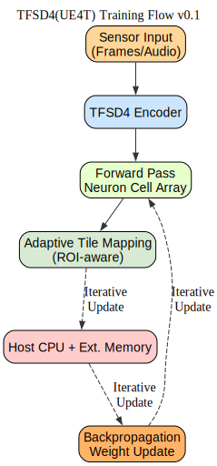
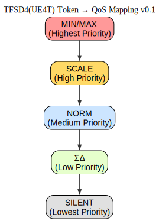
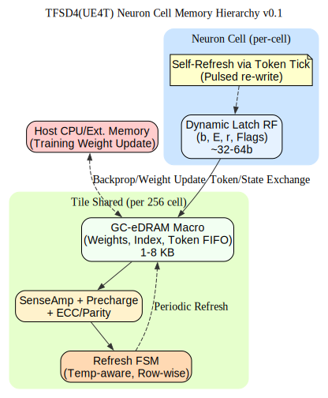

**免责声明**：本文件的韩文 (KO) 版本为原始版本。  
如在翻译中出现问题或歧义，请参考韩文版本。

---

# TFAI 神经形态芯片 (NMC) 架构

本文档描述了基于 **UE4T 的神经形态 ASIC 的外部公开架构**。UE4T 是一种 4bit 格式，**同时支持事件驱动 (event-driven)** , **和脉冲强度 (spike intensity) 表示**，克服了传统脉冲神经网络 (SNN) 和人工神经网络 (ANN) 的局限性。

---

## 🔑 UE4T 核心优势

1. **脉冲强度表示**

 - 传统 SNN：仅表示是否发火 (0/1) 和时序 → 缺乏精确的数值信息。
 - UE4T：通过 `NORM_ESC + 4bit payload` **定量传递强度 (magnitude)**。
 - 结果：支持基于梯度下降 (Gradient Descent) 的学习。

2. **无乘法器 ALU (仅移位)**

 - 所有缩放都通过 `2^E` (位移) 实现 → 无需乘法器。
 - 降低功耗和芯片面积 → 可实现低功耗学习/推理 SoC。

3. **时间·事件压缩**

 - 微小变化：`ΣΔ 累积`。
 - 剧烈变化：`MAX/MIN 事件`。
 - 静默时段：`SILENT token`。
 - 有效表示大规模时间序列输入 (视频、音频、传感器数据)。

4. **基于 PBH 的 NoC**

 - **流水线式二叉堆 (Pipelined Binary Heap, PBH)** 仲裁器 进行令牌优先级路由。
 - 令牌类别 → QoS 映射：`MIN/MAX > SCALE > NORM > ΣΔ > SILENT`。
 - 令牌类别本身直接与网络优先级挂钩。

---

## 🧩 系统架构

 - **传感器前端 (Sensor Front-End)**：摄像头 (1080p@30fps)、音频、IMU 等时间序列输入。
 - **UE4T 编码器 (UE4T Encoder)**：将输入信号转换为 4bit 令牌流。
 - **神经元单元阵列 (Neuron Cell Array)**：256 个单元/tile，32×32 NoC (8192 个 tile，可扩展至数十万至数百万个单元)。
 - **自适应单元映射 (Adaptive Tile Mapping)**：基于 ROI·稀疏性动态调整 tile 大小 → 优化 CNN 学习。
 - **PBH 仲裁器 + 多级 NoC (Multi-Stage NoC)**：基于令牌优先级的路由。
 - **主控 CPU 和外部内存 (Host CPU & External Memory)**：学习时更新权重、管理数据集 I/O。
 - **片上 SRAM / 存储 (On-chip SRAM / Storage)**：令牌缓冲区、参数存储。

---

## 📚 学习流程

1. 传感器输入 → UE4T 编码器 → 4bit 令牌。
2. 前向传播：令牌 → 神经元单元阵列。
3. 主控 CPU + 外部内存：反向传播和权重更新。

**资源需求**

- CNNs 基本为固定内核 + 均匀运算结构 → 在 POI (Point Of Interest) 外部也会发生不必要的运算。
- 近期视频算法 (例如：视频编解码、目标检测) **采用自适应分块 (adaptive tiling)** 技术，对 POI 区域用小 tile 处理，背景用大 tile 处理，以最大化效率。
- UE4T NMC 采用相同原理：**灵活应用神经元单元和 tile 的映射**。
- 当前设计目标：在约 10 万个神经元单元单位上支持自适应分块。

这使得 CNN 学习时也能在不浪费资源的情况下进行实时优化。

---

## ⚡ 推理流程

1. 相同输入 (1080p@30fps) → UE4T 编码器。
2. 仅前向令牌路径 → 神经元单元阵列。
3. 主控 CPU 干预最小 (权重固定，无需 Δb/ΔE)。
4. 推理所需的资源仅为学习时的约 1/10。

---

## 🌐 NoC 结构

- 第一级 (局部网格, Local Mesh)：tile 内部 256 个单元间/tile 间连接。
- 第二级 (集群树, Cluster Tree)：基于二叉堆的仲裁器 (应用优先级)。
- 第三级 (全局骨干, Global Backbone)：混合网格-树 (可扩展性 + 效率)。

**优点**:
 - 树结构 → 最小化延迟。
 - PBH 仲裁器 → 保证基于令牌类别的 QoS。
 - 混合网格-树 → 确保可扩展性和稳定的带宽。

---

## 🎯 令牌 → QoS 映射

- MIN/MAX: 最高优先级 → 立即传递。
- SCALE: 动态范围调整 → 高优先级。
- NORM: 普通信号 → 中等优先级。
- ΣΔ: 微小变化累积 → 低优先级。
- SILENT: 空闲时段 → 最低优先级。

---

## 🔑 附加改进计划
 - 在现有神经元单元模块中，用类似 DRAM 的动态锁存结构替代高功耗的 SRAM。

 - [Detailed Description of **TFAI Neuron Cell Memory Hierarchy (v0.1)**](Neuron_Cell_Memory_zh.md)

 - 

 - More Detailed Study of DRAM-like Memory in SoC is 
 - [UE4T TFAI (v0.2)](UE4T_Neuron_DRAMlike_Study_v0.2_zh.md)

---

## 📌 总结

 - 基于 UE4T 的 NMC **通过自适应分块 + 脉冲强度表示来支持** CNN 学习。
 - 相比传统 SNN → 获得了可学习性。
 - 相比传统 ANN → 通过仅移位 ALU 降低了功耗。
 - 混合 NoC + PBH 仲裁器 → 实现基于令牌 QoS 的实时路由。
 - 同时支持 CNN/Transformer 的学习和推理，可实现大规模视频/音频的实时处理。

