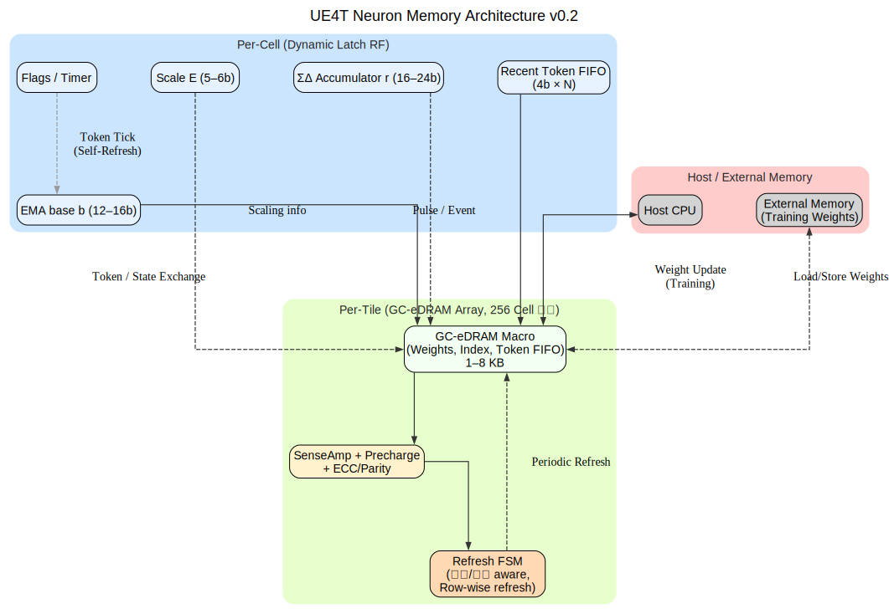

**Disclaimer** : 본 문서는 한국어(KO) 버전이 원본이며, 번역 과정에서 발생할 수 있는 문제나 모호한 부분은 한국어 버전을 참조하시기 바랍니다.

---

# UE4T 뉴런 셀 내 DRAM-like 메모리 스터디 (v0.2)

[KO](UE4T_Neuron_DRAMlike_Study_v0.2.md) | [EN](UE4T_Neuron_DRAMlike_Study_v0.2_en.md) | [ZH](UE4T_Neuron_DRAMlike_Study_v0.2_zh.md)

UE4T 기반 **뉴런 셀 내부 메모리**를 FPGA에서는 BRAM/분산 RAM으로 프로토타이핑하되, ASIC에서는 **동적 플립플롭/펄스드 래치 기반 RF**와 **GC-eDRAM**(Gain-Cell eDRAM) 등 **DRAM-like 저장소**로 전환하는 방향을 정리한다. 본 문서는 후보 기술, 배치 전략(무엇을 어디에 둘 것인가), 리프레시/신뢰성, 자원 감(면적·전력·타이밍), FPGA 연결, 권장 마이크로아키텍처, 리스크/완화안을 한 번에 제시한다.

---

## 1) 후보 기술 옵션 요약

| 옵션 | 비트셀 | 밀도 | 속도/에너지 | 유지/리프레시 | 포트/확장성 | 비고 |
|---|---|---|---|---|---|---|
| **SRAM** | 6T/8T/10T | 낮음 | 매우 빠름, 무리프레시 | 불필요 | 멀티포트 용이 | 면적/누설 크고 비용↑ |
| **GC-eDRAM** | 2T1C/3T1D/5T 등 | **높음** | 빠름, 저에너지 | **리프레시 필요(수 ms–수백 ms)** | 멀티포트는 주변회로 | 로직 공정 호환·고밀도, 사례 다수 [sites.utexas.edu], [Nature], [people.ece.umn.edu] |
| **동적 래치/펄스드 래치 RF** | D-Latch 기반 | 중간 | 빠름, 저면적/저누설 | **주기적 재기입 필요** | 멀티포트 제한 | 레지스터파일/스몰 버퍼 적합 [eScholarship], [ResearchGate], [researchpublish.com] |
| **1T1C eDRAM (MIM cap)** | 1T1C | **최고** | 빠름, CIM 응용 활발 | **리프레시 필요** | 센스앰프/프리차지 요구 | eDRAM-CIM/1T1C 사례 다수 [ResearchGate +2] |
| **eMRAM** | STT-MRAM | 중간 | 읽기 빠름/쓰기 에너지↑ | 무리프레시 | 단순 포트 | 일부 파운드리 옵션, 공정가용성 의존 [synopsys.com] |

> 참고: **GC-eDRAM**은 2T1C/3T류 “게인셀”로 **로직 공정 호환/높은 밀도/확장된 유지시간**을 달성하는 임베디드 DRAM 계열. 최신 논문들은 **수 ms–수백 s**까지 유지시간을 보고, FinFET 노드에서도 고속 동작을 달성함. [sites.utexas.edu], [Wiley Online Library], [ResearchGate]

---

## 2) 뉴런 셀 안에서 “무엇을 어디에” 둘 것인가 (메모리 계층)

### UE4T 뉴런 셀 상태 예시
- `b`(EMA 베이스, 12–16b), `E`(스케일, 5–6b), `r`(ΣΔ 누산기, 16–24b)  
- 최근 토큰 FIFO(수 엔트리 × 4b), 로컬 통계/카운터(8–16b), 스파스 연결용 인덱스

### 제안하는 **2단 구조**

**① 셀-로컬(ultra-local) 동적 래치 저장소**  
- **대상:** `b, E, r`, 소수의 플래그/타이머(총 수십 비트/셀)  
- **구현:** **펄스드 래치 기반 레지스터 파일**(혹은 단순 래치 어레이)  
- **장점:** 클럭-게이팅 + 펄스 폭 제어로 **저면적/저누설/고속**, 리프레시는 **재기입(write-back)**으로 간단 처리. UE4T는 토큰/타이밍이 촘촘하여 **자연스러운 셀프-리프레시 주기** 설정이 용이. [eScholarship], [ResearchGate]

**② 타일-공유(shared) GC-eDRAM 소형 배열**  
- **대상:** 가중치/커넥션 인덱스/최근 토큰 FIFO 등 **수백 b–수 kB** 급  
- **구현:** **2T1C/3T1D GC-eDRAM 매크로** + **초소형 센스앰프/프리차지**  
- **장점:** SRAM 대비 **큰 면적 절감** + 충분한 대역폭. UE4T는 **저정밀(4b)·이벤트성**이라 **비트선 스윙/센스앰프 최적화** 여지 큼. 필요 시 **CIM(Compute-in-Memory)** 경량화도 가능. [sites.utexas.edu], [ResearchGate]

> **요약:** 셀-로컬 상태는 **동적 래치**, 용량 큰 항목은 **타일-공유 GC-eDRAM**. (SRAM은 전역 버퍼/멀티포트 제어 등 **최소한**으로)

---

## 3) 리프레시/신뢰성 전략 (뉴런 이벤트에 맞춘 “인지형 리프레시”)

- **온도/전압 의존 유지시간:** 동적 저장은 온도↑, VDD↓에서 유지시간↓ → **온칩 온도센서/스피드빈**으로 리프레시 간격 가변. (GC-eDRAM 보정 기법 다수) [Nature]  
- **이벤트 기반 리프레시:** 셀 토큰 발생이 없을 때 **SILENT 타임아웃**과 연동해 주기적 재기입.  
- **로컬 리프레시 FSM:** 타일마다 초소형 FSM이 **Row-by-Row/그룹 리프레시** 수행, 액세스와 겹치면 **중단-재개(pause-resume)**.  
- **경량 ECC/Parity:** 4b 토큰/상태에 대해 **Nibble parity** 또는 **경량 SEC**.  
- **센스앰프 최적화:** **단일 비트라인/저스윙 SA** 등 DRAM 에너지 절감형 회로 채용 여지. [MDPI]

---

## 4) 타이밍/전력/면적 감 잡기 (거칠게)

- **동적 래치 RF:** 32–128b/셀 기준, 플립플롭 대비 **면적 ~30–40%↓, 누설↓** 보고 사례(공정/설계 따라 상이). [eScholarship]  
- **GC-eDRAM 2T1C:** 6T SRAM 대비 **2–4× 밀도↑**가 흔함. 유지시간 **수 ms–수십 ms**도 무난, 보강 시 **수 s–수백 s** 보고. 액세스에는 **센스앰프/프리차지** 오버헤드 반영 필요. [people.ece.umn.edu], [Wiley Online Library]  
- **CIM 옵션:** 1T1C/2T1C 기반 **미소 스윙 누산/비트-패럴** 활용 시 4b 연산에서 **면적·에너지 FoM 향상** 사례. UE4T 4b 페이로드에 적합. [sites.utexas.edu], [ResearchGate]

---

## 5) FPGA 프로토타입과의 연결

- **FPGA:** BRAM/URAM(대용량), 분산 RAM/LUTRAM(초소형)으로 기능 에뮬레이트.  
  **동적 래치/DRAM-like**의 실제 누설특성은 FPGA에서 재현이 어려우므로 권장 X → **주기적 재기입 로직**만 모델링하여 **기능 합격** 여부 판단.  
  참고: [docs.amd.com], [projectf.io]

---

## 6) 권장 마이크로아키텍처 스케치

- **Per-Cell (dynamic latch block)**  
  - 레이턴시 민감 상태: `b(EMA)`, `E`, `r`, 플래그 → **pulsed-latch RF**  
  - “토큰 틱”마다 자연스런 리프레시(덮어쓰기) 발생 → **강제 리프레시 최소화**

- **Per-Tile (GC-eDRAM macro 1–8 KB급)**  
  - 가중치/스파스 인덱스/토큰 FIFO  
  - **온도 의존 리프레시 간격** + **블럭 단위 저전력 프리차지/SA**  
  - 경량 ECC/Parity, **토큰 클래스(QoS)**에 따라 **Row 우선 순환 리프레시**

- **타이밍**  
  - UE4T 토큰 주파수(예: 수 MHz 등) 대비 **리프레시 주기 ≫ 토큰 주기**가 되도록 설계  
  - 읽기-변경-쓰기 경로에 **버스 홀드/원사이클 복원** 삽입 → 신뢰성↑

---

## 7) 리스크 & 완화

- **공정 가용성:** 파운드리/노드에 따라 eDRAM 옵션 유무 상이 → **게인셀(로직 호환)** 우선 검토, 불가 시 **소형 SRAM 대체**. [Nature]  
- **PVT 편차:** 유지시간 편차 → **온칩 센서 기반 가변 리프레시** + **필드-튜닝 레지스터**  
- **테스트:** BIST에 **리프레시-스트레스 패턴** 포함, **데이터 리텐션 스크린** 절차 필요

---

## 결론/제안

- **뉴런 셀 내부 핵심 상태는 ‘동적 래치 RF’**, **타일 공유 큰 용량은 ‘GC-eDRAM’**:  
  - 면적/전력 최적 + UE4T의 **이벤트·저정밀 특성과 상보적**  
  - **UE4T 토큰 타이밍을 활용한 인지형 리프레시**로 추가 오버헤드 최소화  
- **FPGA**에서는 BRAM/LUTRAM으로 기능 확인 → **ASIC 전환 시 GC-eDRAM + pulsed-latch**로 치환

---

## 블록다이어그램

---

## 참고(출처 식별자)

- [sites.utexas.edu] Gain-Cell eDRAM 관련 연구/강의 자료  
- [Nature] eDRAM/GC-eDRAM 및 임베디드 메모리 개요 논문/리뷰  
- [people.ece.umn.edu] 메모리/센스앰프/DRAM 회로 관련 강의/논문 링크  
- [eScholarship] 동적 래치/레지스터 파일 최적화 연구  
- [ResearchGate] GC-eDRAM/1T1C eDRAM/CIM 연계 사례  
- [researchpublish.com] 레지스터 파일/펄스드 래치 설계 보고서  
- [Wiley Online Library] eDRAM/임베디드 메모리 서베이  
- [MDPI] 저스윙 센스앰프/DRAM 에너지 절감 기법  
- [synopsys.com] eMRAM 기술/파운드리 IP 자료  
- [docs.amd.com] FPGA BRAM/URAM/분산 RAM 가이드  
- [projectf.io] FPGA 메모리 실습 자료
