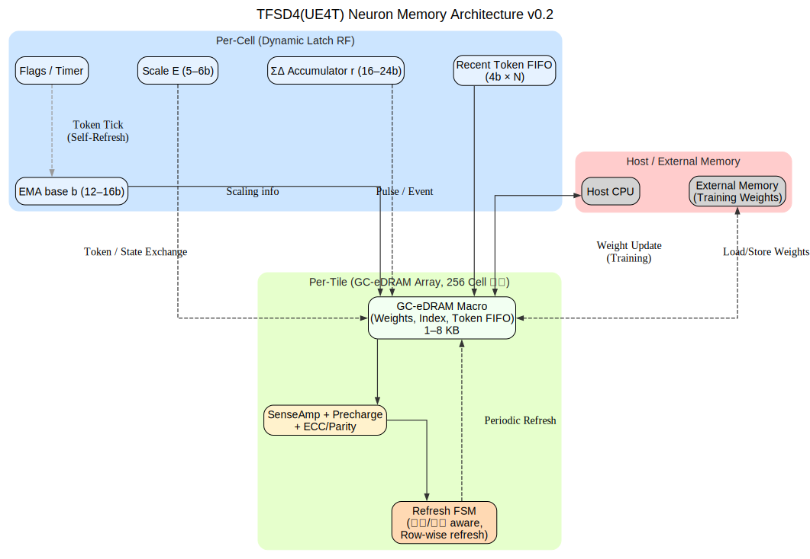

**免责声明**：本文件的韩文 (KO) 版本为原始版本。  
如在翻译中出现问题或歧义，请参考韩文版本。

---

# UE4T 神经元 DRAM-like 研究 v0.2

[KO](UE4T_Neuron_DRAMlike_Study_v0.2.md) | [EN](UE4T_Neuron_DRAMlike_Study_v0.2_en.md) | [ZH](UE4T_Neuron_DRAMlike_Study_v0.2_zh.md)

## 1) 候选技术选项总结
| 选项 | 位单元 | 密度 | 速度/能耗 | 保持/刷新 | 端口/扩展性 | 备注 |
|---|---|---|---|---|---|---|
| SRAM | 6T/8T/10T | 低 | 非常快，无需刷新 | 不需要 | 多端口容易 | 面积/漏电大，成本↑ |
| GC-eDRAM | 2T1C/3T1D/5T 等 | 高 | 快，低能耗 | 需要刷新 (几毫秒–数百毫秒) | 多端口需外围电路 | 工艺兼容，高密度，已有大量案例 |
| 动态锁存/脉冲锁存 RF | 基于 D-Latch | 中 | 快，低面积/低漏电 | 需要周期性重写 | 多端口受限 | 适合寄存器文件/小缓冲 |
| 1T1C eDRAM (MIM 电容) | 1T1C | 最高 | 快，CIM 应用活跃 | 需要刷新 | 需要感应放大器/预充电 | 1T1C 案例众多 |
| eMRAM | STT-MRAM | 中 | 读快/写能耗↑ | 无需刷新 | 简单端口 | 部分代工厂选项，可用性依赖工艺 |

参考: **Gain-Cell eDRAM (GC-eDRAM)** 是 2T1C/3T 类“增益单元”嵌入式 DRAM，兼容逻辑工艺/高密度/长保持时间。  
最新论文显示保持时间可从几毫秒扩展到数百秒，在 FinFET 节点中也能高速运行。

---

## 2) 在神经元单元内部“放什么放在哪里”（存储层次）

UE4T 神经元单元状态示例:
- b (EMA 基准, 12–16b), E (尺度, 5–6b), r (ΣΔ 累加器, 16–24b)  
- 最近 Token FIFO (若干条目×4b), 本地统计/计数器 (8–16b), 稀疏连接索引  

建议的两级结构:
- **单元本地动态锁存存储**
  - 对象: b, E, r, 少量标志/定时器 (每单元数十位)  
  - 实现: 基于脉冲锁存的寄存器文件 (或简单锁存阵列)  
  - 优点: 时钟门控+脉宽控制 → 低面积/低漏电/高速。刷新通过 **重写 (write-back)** 简单完成。UE4T Token/时序密集 → 容易形成自然的自刷新周期。  
- **Tile 共享 GC-eDRAM 小阵列**
  - 对象: 权重/连接索引/最近 Token FIFO，容量数百 b–数 KB  
  - 实现: 2T1C/3T1D GC-eDRAM 宏单元 + 小型感放/预充电  
  - 优点: 相比 SRAM 面积大幅节省 + 足够带宽。UE4T 是低精度 (4b)、事件型 → 位线摆幅/SA 优化空间大。如有需要，可支持轻量 CIM。  

总结: 单元本地状态 = 动态锁存；大容量项 = Tile 共享 GC-eDRAM。(SRAM 仅最小化用于全局缓冲/多端口控制)

---

## 3) 刷新/可靠性策略 (与神经元事件关联的“认知刷新”)

- 温度/电压依赖保持时间: 温度↑, VDD↓ → 保持时间↓ → 通过片上温度传感器/速度分档可变刷新间隔。(GC-eDRAM 有多种补偿方法)  
- 事件驱动刷新: 当单元 Token 不发生时，结合 SILENT 超时定期重写。  
- 本地刷新 FSM: 每个 Tile 配小型 FSM，逐行/分组刷新，与访问冲突时支持暂停-恢复。  
- 弱 ECC/奇偶校验: 针对 4b Token/状态采用 Nibble parity 或轻量 SEC 保护。  
- 感放优化: 单比特线/低摆幅 SA 等 → 可采用 DRAM 降能电路。  

---

## 4) 时序/功耗/面积 粗估

- 动态锁存 RF: 32–128b/单元，面积比触发器小 ~30–40%，漏电低 (依工艺/设计不同)  
- GC-eDRAM 2T1C: 密度比 6T SRAM 高 2–4 倍。保持时间通常为几毫秒–数十毫秒，优化设计可达数秒–数百秒。需考虑 SA/预充电开销。  
- CIM 选项: 1T1C/2T1C 基础微摆幅累加/位并行 → 4b 运算中面积/能效优值提升。适合 UE4T 4b 载荷。  

---

## 5) 与 FPGA 原型的连接

- FPGA: BRAM/URAM (大容量)、分布式 RAM/LUTRAM (超小容量) 实现功能仿真。  
- 动态锁存/类 DRAM 在 FPGA 上无法再现实际漏电特性，不推荐。→ 仅通过周期性重写逻辑建模，检查功能正确性。  

---

## 6) 推荐微架构草图

**单元级 (动态锁存块)**
- 延迟敏感状态: b(EMA), E, r, 标志 → 脉冲锁存 RF  
- 每个“Token Tick”自然覆盖 → 额外刷新最小化  

**Tile 级 (GC-eDRAM 宏单元 1–8 KB)**
- 权重/稀疏索引/Token FIFO  
- 温度依赖刷新间隔 + Block 级低功耗预充电/SA  
- 轻量 ECC/Parity，根据 **Token 类 (QoS)** 执行行优先刷新  

**时序**
- UE4T Token 频率 (如几 MHz) >> 刷新周期 → 按此设计  
- 在读-改-写路径中插入总线保持/单周期恢复 → 提高可靠性  

---

## 7) 风险与缓解

- 工艺可用性: 取决于代工厂/节点是否支持 eDRAM → 优先考虑兼容逻辑的 Gain-Cell，不行则小型 SRAM 替代。  
- PVT 偏差: 保持时间偏差 → 基于片上传感器的可变刷新 + 现场调节寄存器。  
- 测试: BIST 中加入刷新压力模式，需要数据保持筛选流程。  

---

## 结论/建议

**神经元单元内部核心状态 = 动态锁存 RF**，**Tile 共享大容量 = GC-eDRAM**:  
- 面积/功耗最优 + 与 UE4T 的事件/低精度特性互补  
- 利用 UE4T Token 时序进行认知刷新，额外开销最小  
- FPGA 使用 BRAM/LUTRAM 验证功能 → ASIC 时替换为 GC-eDRAM + 脉冲锁存

---

## 方块图

---

## 参考 (来源标识)

- [sites.utexas.edu] Gain-Cell eDRAM 相关研究/课程资料  
- [Nature] eDRAM/GC-eDRAM 及嵌入式存储综述论文/评论  
- [people.ece.umn.edu] 存储/感应放大器/DRAM 电路课程/论文链接  
- [eScholarship] 动态锁存/寄存器文件优化研究  
- [ResearchGate] GC-eDRAM/1T1C eDRAM/CIM 案例  
- [researchpublish.com] 寄存器文件/脉冲锁存设计报告  
- [Wiley Online Library] eDRAM/嵌入式存储综述  
- [MDPI] 低摆幅感应放大器/DRAM 降能技术  
- [synopsys.com] eMRAM 技术/代工厂 IP 资料  
- [docs.amd.com] FPGA BRAM/URAM/分布式 RAM 指南  
- [projectf.io] FPGA 存储实践资料
