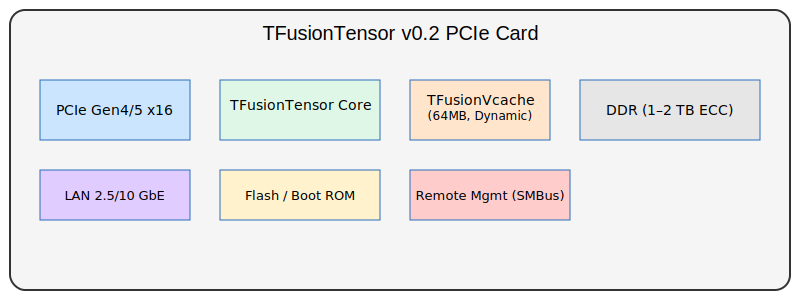

# TFusionTensor Architecture v0.2

**Disclaimer**: The Korean (KO) version of this document is the original reference. 
In case of any translation issues or ambiguities, please refer to the Korean version.

[KO](TFusionTensor_Architecture_v0.2.md) | [EN](TFusionTensor_Architecture_v0.2_en.md)
---

## 1. 개요

TFusionTensor v0.2는 범용 NPU/TPU 아키텍처로, 전력 효율·TCO 최적화를 목표로 설계되었습니다.  
특히 TFusionVcache(64MB, 가변 정책)를 포함하여 DRAM 대역폭 병목을 완화합니다.  

## 2. 전체 PCIe 카드 블록 다이어그램

아래는 TFusionTensor v0.2를 PCIe 카드 폼팩터에 집적한 전체 블록 구조입니다.  

- PCIe Gen4/5 x16 인터페이스
- DDR (최대 1–2 TB, 72bit ECC)
- TFusionTensor Core Cluster
- TFusionVcache (64MB, Dynamic Policy)
- LAN (2.5/10 GbE) 포트
- Remote Management (SMBus)
- Flash/Boot ROM

## 3. 데이터플로우 특징

- Conv → Weight-stationary  
- GEMM → Output-stationary  
- Activation/Normalization → On-chip PostOps  

## 4. 참고

- [TFusionVcache v0.1 바로가기 (KO)](TFusionVcache/TFusionVcache_v0.1.md)  
- [TFusionVcache v0.1 바로가기 (EN)](TFusionVcache/TFusionVcache_v0.1_en.md)

---
