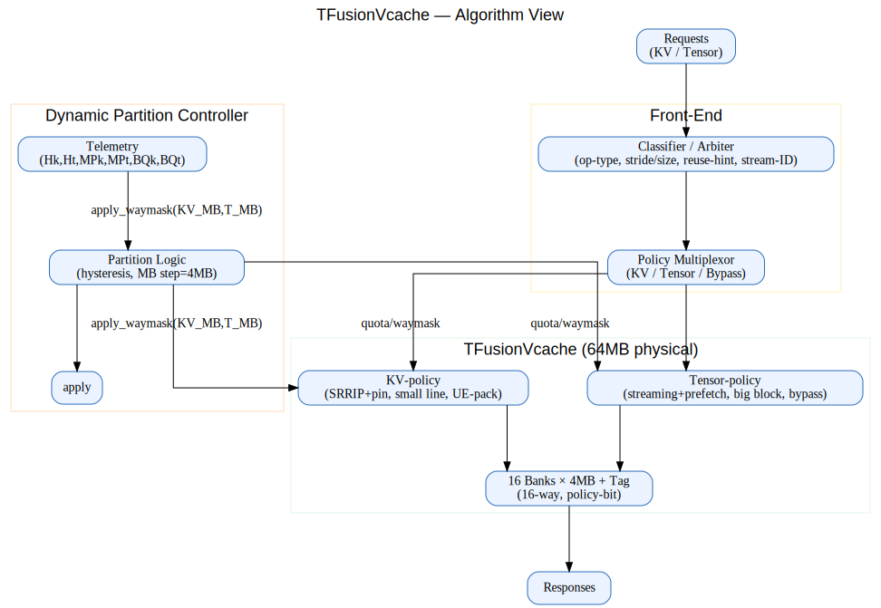
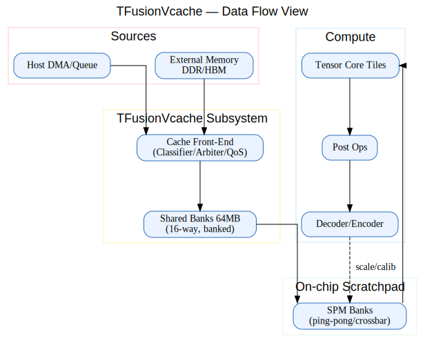
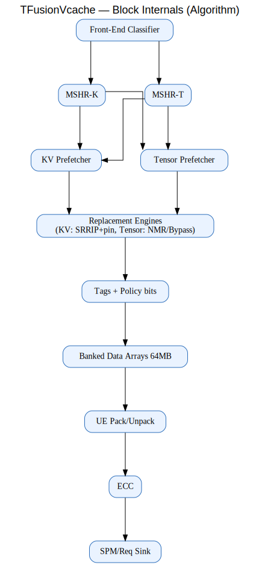
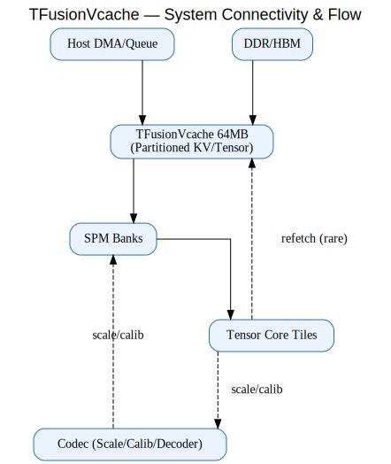

# TFusionVcache (TFVcache) Policy v0.1 — English Edition

**Disclaimer**: The Korean (KO) version of this document is the original reference. In case of any translation issues or ambiguities, please refer to the Korean version.

---

## 1. Overview

In large-scale **AI computation** on **TPUs/GPUs**, caches of **tens to hundreds of MB** are typically required.  
- Common capacities include **32 MB, 64 MB, 128 MB** or more,  
- depending on **model size, batch size, and sequence length**.  

Here, to illustrate a case of **co-existing multiple cache policies**, we set a **64 MB** physical cache as the baseline.  
This single 64 MB cache is logically divided into **KV-policy** and **Tensor-policy** regions.  
The partition ratio can dynamically change depending on hit rate and workload behavior.  
We call this structure **TFusionVcache**.  

---

## 2. Motivation

### 2-1. Limits of traditional hierarchy
Traditional CPU caches follow an L1 → L2 → L3 hierarchy.  
While deeper hierarchies increase hit rates, they **accumulate latency**, which is problematic for massively parallel AI accelerators.  

### 2-2. AI workload characteristics
- **KV-cache** (LLM decoder stage) → small tokens, sequential, highly reusable.  
- **Tensor ops** (matmul/conv) → large blocks, streaming, often one-time use.  
- A single uniform policy leads to low hit rate for one side and wasted space for the other.  

👉 Therefore, **workload-specific tailored policies** must co-exist to maximize efficiency.  

---

## 3. TFusionVcache Structure

- Physical: **64 MB single banked cache (16 banks × 4 MB)**  
- Logical: **KV-policy region** and **Tensor-policy region**  
- Initial: 32 MB / 32 MB → dynamically adjusted (min 16 MB, max 48 MB)

### Front-End Cache Multiplexor
- Incoming requests are classified as **KV or Tensor** and routed accordingly.  
- Hit rate, miss penalty, and DRAM queue occupancy telemetry adjust partition ratio in real time.  

---

## 4. Per-policy Behaviors

### KV-policy
- Small line size (64–128B)  
- Replacement: **SRRIP + pin bit** (always keep token windows)  
- Prefetch: next token (+1 ahead)  
- **Analogy**: Sticky notes on your desk you always keep visible for exam prep.  

### Tensor-policy
- Larger block size (256–512B), stream buffer aware  
- Replacement: **NMR / Bypass priority** (do not cache one-time data)  
- Prefetch: at least 2 tiles ahead  
- **Analogy**: Buying bulk bottled water in advance and stacking it in your shopping cart.  

---

## 5. Dynamic Partitioning

```pseudo
S_k = w1*Hk - w2*MPk - w3*BQk
S_t = w1*Ht - w2*MPt - w3*BQt
Δ = S_k - S_t
if Δ > θ and KV_MB < 48: KV_MB += 4; T_MB -= 4
elif Δ < -θ and T_MB < 48: T_MB += 4; KV_MB -= 4
```

**Symbol definitions (brief):**
- `S_k`: score of KV region (indicator for expansion need)  
- `S_t`: score of Tensor region  
- `w1`–`w3`: weights (recommended 0–1). `w1`=importance of hit rate, `w2`=miss penalty, `w3`=DRAM queue occupancy  
- `Hk`, `Ht`: hit rates of KV/Tensor (0–1)  
- `MPk`, `MPt`: average miss latency (ns or cycles)  
- `BQk`, `BQt`: DRAM queue occupancy during miss handling (0–1 or %)  
- `θ`: threshold for partition change (hysteresis)  

- Δ > 0 → expand KV cache  
- Δ < 0 → expand Tensor cache  
- Adjust in **4 MB steps** with cooldown intervals.  

---

## 6. Diagrams (Visualization)

### 6-1. Algorithm view


### 6-2. Dataflow view


### 6-3. Cache block internals


### 6-4. System integration


---

## 7. TCO (Total Cost Optimization)

- Reduce **DRAM/HBM transfers** → fewer transactions, lower energy, reduced TCO.  
- Improve latency without increasing clock → lower thermal/cooling cost.  
- Higher performance per silicon area → better ROI (CAPEX efficiency).  

**Analogy:**  
- Instead of buying water every time at a convenience store (DRAM), you **stock 2-liter bottles in your fridge (Cache)**.  
- TFusionVcache is like a **smart fridge** with shelves adjustable between “drinks” and “water” depending on need.  

---

## 8. Conclusion

**TFusionVcache** achieves:  
- Flat, **single-depth** structure  
- Policy-aware optimization  
- Dynamic partitioning  
- QoS-driven operation  

Compared to traditional hierarchies, this reduces latency, increases efficiency, and optimizes TCO.  

👉 Even undergraduate students can replicate the principle in other systems: **network routers, SSD controllers, IoT edge devices**, etc.  
